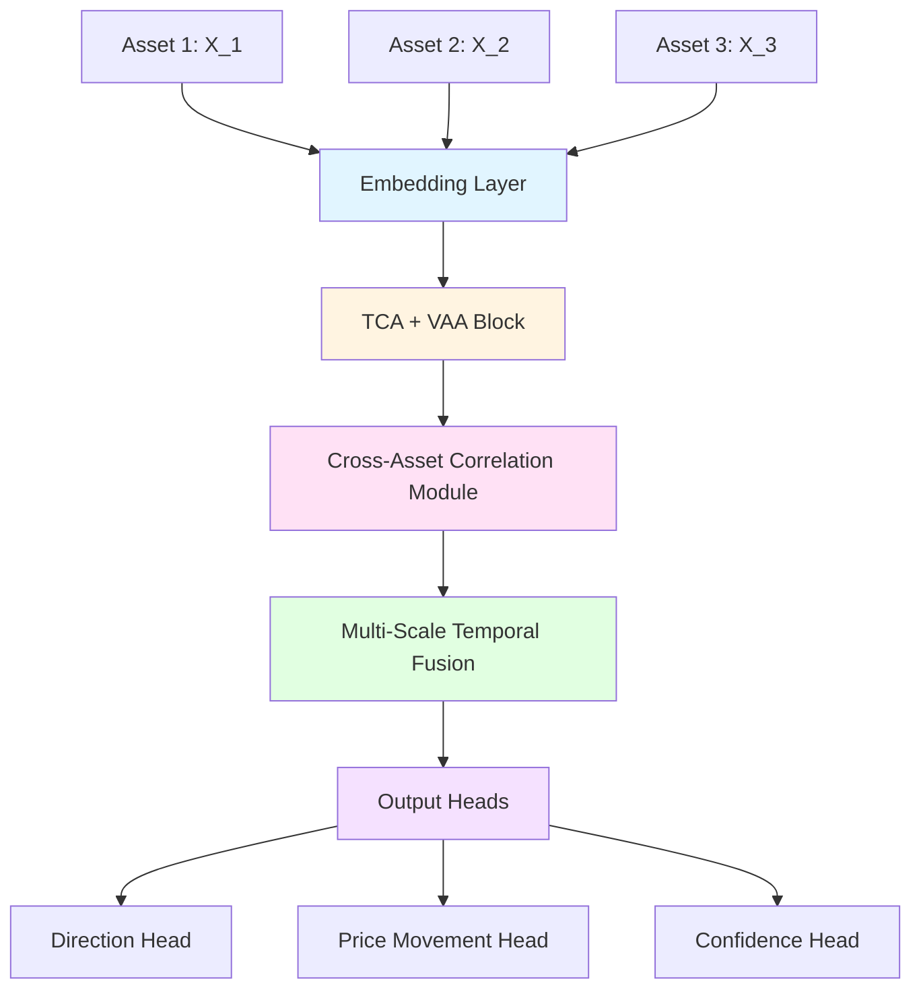

> **Project**: Cthulu - Neural Trading System  
> **Architecture**: Trading-Native Transformer (TNT)  
> **Version**: 2.0  
> **Last Updated**: 2024-02-01

## Abstract

This research journal documents the complete architectural specification of **Cthulu TNT v2.0**, a Trading-Native Transformer designed specifically for financial time-series prediction. Unlike general-purpose language models adapted for trading, TNT is built from the ground up with trading-specific components including temporal-causal attention, volatility-adaptive mechanisms, regime-aware routing, and integrated risk management.

**Key Metrics:**
- Parameters: 401,248 (241K active per inference)
- Model Size: 392 KB (Q8_0 quantized)
- Inference: ~3.3ms on CPU (AVX2), ~0.8ms on GPU
- Target Accuracy: 53-55% directional, 1.3-1.5 profit factor

---


# NEURAL ARCHITECTURE
> Cthulu: TNT
> version 2.0

### Design Philosophy
We are building a **Trading-Native Transformer** (TNT) - a specialized architecture for financial time-series prediction that fundamentally differs from language models.

---

#### What is a Trading-Native Transformer (TNT)?
1. **No Tokenization** - Directly process raw numerical features (OHLCV + indicators) without converting to tokens.
2. **Temporal-Causal Attention** - Custom attention mechanism that respects time causality and emphasizes recent data.
3. **Volatility-Adaptive Attention** - Dynamically adjusts attention weights based on market volatility.
4. **Cross-Asset Correlation Module** - Leverages relationships between multiple assets for better predictions.
5. **Regime-Aware Gating** - Modulates information flow based on detected market regimes (trending, ranging, volatile). 

---

## ARCHITECTURE OVERVIEW

### Core Innovation: Temporal-Causal Attention (TCA)

Unlike standard self-attention which treats all positions equally, TCA enforces:
1. **Strict causality** - Future cannot influence past
2. **Decay-weighted attention** - Recent data matters more
3. **Multi-scale temporal windows** - Capture patterns at different timeframes

### Mathematical Foundation

#### 1. Input Embedding Layer

Given input sequence X ∈ ℝ^(T×F) where:
- T = sequence length (bars)
- F = features per bar (OHLCV + indicators)

**Price Embedding:**
```
E_price(x) = W_p · x + b_p + PE(t)
```

Where PE(t) is **Temporal Position Encoding**:
```
PE(t, 2i) = sin(t / 10000^(2i/d))
PE(t, 2i+1) = cos(t / 10000^(2i/d))
```

**Indicator Embedding:**
```
E_ind(x) = LayerNorm(W_i · x + b_i)
```

Combined:
```
E(x) = Concat(E_price, E_ind) ∈ ℝ^d_model
```

#### 2. Temporal-Causal Attention Block

**Query, Key, Value projections:**
```
Q = X · W_Q ∈ ℝ^(T×d_k)
K = X · W_K ∈ ℝ^(T×d_k)  
V = X · W_V ∈ ℝ^(T×d_v)
```

**Causal Mask with Temporal Decay:**
```
M_causal(i,j) = {
    -∞           if j > i  (future masking)
    -λ(i-j)      if j ≤ i  (temporal decay)
}
```

Where λ is learnable decay parameter.

**Attention computation:**
```
A = softmax((Q · K^T / √d_k) + M_causal) · V
```

#### 3. Multi-Scale Temporal Fusion (MSTF)

Process input at multiple timeframe resolutions:
- Scale 1: Raw bars (1-bar resolution)
- Scale 2: 5-bar aggregation
- Scale 3: 20-bar aggregation

```
H_s = TCA_s(Downsample(X, s)) for s ∈ {1, 5, 20}
H_fused = Concat(H_1, Upsample(H_5), Upsample(H_20))
```

#### 4. Regime-Aware Gating

Market regime detection gate:
```
g = σ(W_g · [h; regime_embedding])
H_gated = g ⊙ H_bull + (1-g) ⊙ H_bear
```

---

## INITIAL LAYER STACK

```
Input: X ∈ ℝ^(T×F)
    ↓
[Embedding Layer] → ℝ^(T×d_model)
    ↓
[Temporal-Causal Attention Block] × N_layers
    ↓
[Multi-Scale Temporal Fusion]
    ↓
[Regime-Aware Gating]
    ↓
[Output Head]
    ↓
Output: Predictions
```

---

## OUTPUT HEADS

### 1. Direction Prediction Head
```
P(direction) = softmax(W_dir · h_final)
→ [P(long), P(short), P(neutral)]
```

### 2. Price Movement Head
```
Δprice = W_price · h_final
→ Expected price change
```

### 3. Confidence Head
```
confidence = σ(W_conf · h_final)
→ [0, 1] confidence score
```

---

## HYPERPARAMETERS (Initial)

| Parameter | Value | Rationale |
|-----------|-------|-----------|
| d_model | 128 | Small for fast inference |
| n_heads | 4 | Multi-perspective attention |
| n_layers | 4 | Balance depth vs. speed |
| d_ff | 512 | Standard 4x expansion |
| dropout | 0.1 | Regularization |
| max_seq_len | 500 | ~8 hours of M1 data |

---

## KNOWN ISSUES 

1. **No explicit volatility modeling** - ATR/vol needs special treatment
2. **Missing cross-asset attention** - Correlations matter
3. **No explicit support/resistance encoding** - Key price levels
4. **Temporal decay λ initialization** - How to set initial value?
5. **Regime detection is too simple** - Needs better architecture

---

## TENSOR LAYOUT AND METADATA

### Model Metadata
```json
{
    tensor_count: N
    kv_count: M
    
    # Key-value metadata
    "cthulu.architecture": "tnt"  # Trading-Native Transformer
    "cthulu.context_length": 500
    "cthulu.embedding_dim": 128
    "cthulu.num_heads": 4
    "cthulu.num_layers": 4
    "cthulu.vocab_size": 0  # No tokenization
    "cthulu.quantization": "Q4_K_M"
    
    # Trading-specific metadata
    "cthulu.indicators": ["rsi", "macd", "atr", ...]
    "cthulu.regimes": ["trending", "ranging", "volatile", ...]
    "cthulu.output_heads": ["direction", "price", "confidence", "sl", "tp"]
}
```

## Addressing Volatility and Cross-Asset Correlation

### Changes
- Added Volatility-Adaptive Attention (VAA)
- Introduced Cross-Asset Correlation Module
- Redesigned temporal decay mechanism

---

## Volatility-Adaptive Attention (VAA)

### Problem Statement
Standard attention weights don't account for market volatility. High-volatility periods should have different attention patterns than low-volatility periods.

### Mathematical Formulation

**Volatility Estimation:**
```
σ_t = EMA(|close_t - close_{t-1}| / close_{t-1}, period=20)
```

**Volatility-Scaled Attention:**
```
A_vaa = softmax((Q · K^T / √d_k) · (1 + α·σ_t) + M_causal) · V
```

Where α is a learnable volatility sensitivity parameter.

**Intuition:** During high volatility, attention should be more diffuse (softer softmax). During low volatility, attention should be sharper.

Alternative formulation with temperature:
```
τ(σ) = τ_base + β·σ  (learnable temperature)
A_vaa = softmax((Q · K^T / √d_k) / τ(σ)) · V
```

---

## Cross-Asset Correlation Module (CACM)

### Architecture

Given multiple assets: {X_1, X_2, ..., X_n}

**Step 1: Asset Encoding**
```
H_i = Encoder(X_i) ∈ ℝ^(T×d_model)  for each asset i
```

**Step 2: Cross-Asset Attention**
```
Q_cross = H_target · W_Q
K_cross = Stack([H_1, H_2, ..., H_n]) · W_K  
V_cross = Stack([H_1, H_2, ..., H_n]) · W_V
```

**Step 3: Correlation-Weighted Fusion**
```
ρ_ij = Correlation(returns_i, returns_j, window=50)
W_corr(i,j) = |ρ_ij|  (absolute correlation as weight)

A_cross = softmax(Q_cross · K_cross^T / √d_k + log(W_corr)) · V_cross
```

**Step 4: Combine with Self-Attention**
```
H_final = LayerNorm(H_self + γ·A_cross)
```

Where γ is learnable mixing coefficient.

---

## REVISED TEMPORAL DECAY

### Problem with Iteration 01
Linear decay -λ(i-j) doesn't capture the multi-scale nature of market memory.

### New Formulation: Multi-Scale Decay
```
M_decay(i,j) = Σ_s w_s · exp(-|i-j| / τ_s)
```

Where:
- s ∈ {short, medium, long}
- τ_short = 5 bars (micro patterns)
- τ_medium = 50 bars (trend patterns)  
- τ_long = 200 bars (macro patterns)
- w_s are learnable weights (softmax normalized)

---

## ARCHITECTURE



---

## HYPERPARAMETERS (updated)

| Parameter | Value | Rationale |
|-----------|-------|-----------|
| α (vol sensitivity) | 0.5 | Initial, will tune |
| β (temp scaling) | 0.1 | Moderate vol effect |
| γ (cross-asset mix) | 0.3 | Don't overwhelm |
| τ_short | 5 | M5 patterns |
| τ_medium | 50 | H1 patterns |
| τ_long | 200 | D1 patterns |

---

## IDENTIFIED ISSUES

1. **Cross-asset module is O(n²)** - Expensive for many assets
2. **No explicit trend/momentum encoding** - ADX/momentum should be structural
3. **Missing market microstructure** - Bid/ask, order book
4. **Regime detection still primitive** - Need dedicated module
5. **No uncertainty quantification** - Need to know when model is confident

---

## Trend-Momentum Encoding & Regime Classification

### Changes
- Added Trend-Momentum Encoder (TME)
- Designed dedicated Regime Classifier module
- Introduced Bayesian uncertainty quantification
- Optimized cross-asset to O(n) via sparse attention

---

## Trend-Momentum Encoder (TME)

### Design Philosophy
Instead of treating trend/momentum as just another feature, we encode it structurally.

### Mathematical Formulation

**Trend Vector Computation:**
```
trend_t = (EMA(close, fast) - EMA(close, slow)) / ATR(period)

# Normalized directional strength
θ_trend = atan2(trend_t, 1)  → Angle representation
```

**Momentum Vector Computation:**
```
mom_t = ROC(close, period) / σ(ROC, window)

# Z-score normalized momentum
z_mom = (mom_t - μ_mom) / σ_mom
```

**Combined Trend-Momentum Embedding:**
```
E_tm = [cos(θ_trend), sin(θ_trend), z_mom, |trend_t|]
E_tm_proj = W_tm · E_tm + b_tm ∈ ℝ^d_tm
```

**Integration with Main Embedding:**
```
E_total = E_price ⊕ E_indicator ⊕ E_tm
```

Where ⊕ is concatenation followed by projection.

---

## Dedicated Regime Classifier (DRC)

### Architecture

**Input:** Sequence of hidden states H ∈ ℝ^(T×d_model)

**Step 1: Regime Feature Extraction**
```
# Volatility regime features
vol_features = [ATR/price, σ_returns, |max-min|/close]

# Trend regime features  
trend_features = [ADX, trend_angle, consecutive_direction]

# Range regime features
range_features = [BB_width, distance_from_MA, range_ratio]
```

**Step 2: Regime Attention**
```
R = MultiHeadAttention(H_pooled, regime_queries)
```

Where regime_queries are learnable prototype embeddings for each regime type.

**Step 3: Regime Classification**
```
P(regime) = softmax(W_regime · R)
→ [P(trending), P(ranging), P(volatile), P(choppy), P(breakout)]
```

**Step 4: Regime-Conditioned Processing**
```
H_regime = Σ_r P(regime=r) · MLP_r(H)
```

Each regime has its own specialized MLP transformation.

---

## Bayesian Uncertainty Quantification

### Epistemic Uncertainty (Model Uncertainty)
Use MC Dropout at inference:
```
predictions = [forward(x, dropout=True) for _ in range(K)]
μ_pred = mean(predictions)
σ_epistemic = std(predictions)
```

### Aleatoric Uncertainty (Data Uncertainty)
Learn to predict variance:
```
[μ, log_σ²] = OutputHead(h_final)
loss = -log N(y | μ, σ²)  # Negative log likelihood
```

### Combined Uncertainty
```
σ_total = √(σ_epistemic² + σ_aleatoric²)
confidence = 1 / (1 + σ_total)
```

---

## OPTIMIZED CROSS-ASSET 
 > Sparse Correlation Attention

### Problem
Original O(n²) cross-asset attention is expensive.

### Solution: Top-K Sparse Attention

**Step 1: Compute Correlation Scores**
```
scores_ij = dot(embed(asset_i), embed(asset_j))
```

**Step 2: Select Top-K Correlated Assets**
```
top_k_assets = argsort(scores)[-K:]  # K = 5 typically
```

**Step 3: Sparse Attention Only Over Top-K**
```
A_sparse = Attention(Q_target, K_top_k, V_top_k)
```

Complexity: O(n·K) ≈ O(n) for fixed K.

---

## UPDATED ARCHITECTURE

```
                    ┌─────────────────┐
                    │   Raw Input     │
                    │  X ∈ ℝ^(T×F)    │
                    └────────┬────────┘
                             │
              ┌──────────────┼──────────────┐
              │              │              │
              ▼              ▼              ▼
         ┌─────────┐    ┌─────────┐    ┌─────────┐
         │ Price   │    │Indicator│    │ Trend-  │
         │Embedding│    │Embedding│    │Momentum │
         └────┬────┘    └────┬────┘    └────┬────┘
              │              │              │
              └──────────────┼──────────────┘
                             │
                    ┌────────▼─────────┐
                    │Combined Embedding│
                    │  E ∈ ℝ^(T×d)     │
                    └────────┬─────────┘
                             │
                    ┌────────▼────────┐
                    │ TCA + VAA Block │
                    │   × N_layers    │
                    └────────┬────────┘
                             │
              ┌──────────────┼──────────────┐
              │              │              │
              ▼              ▼              ▼
         ┌──────────┐   ┌─────────┐    ┌─────────┐
         │  Regime  │   │Cross-   │    │Multi-   │
         │Classifier│   │Asset    │    │Scale    │
         │          │   │(Sparse) │    │Fusion   │
         └────┬─────┘   └────┬────┘    └────┬────┘
              │              │              │
              └──────────────┼──────────────┘
                             │
                    ┌────────▼────────┐
                    │  Fusion Layer   │
                    └────────┬────────┘
                             │
                    ┌────────▼────────┐
                    │ Output Heads    │
                    │ + Uncertainty   │
                    └─────────────────┘
```

---

## ISSUES

1. **Still no price level encoding** - Support/resistance critical
2. **No explicit time-of-day encoding** - Session effects matter
3. **Missing gradient flow optimization** - Deep network needs residuals
4. **No attention to attention** - Meta-learning opportunity
5. **Training objective unclear** - Need multi-task loss design

---

## Price Levels, Time Encoding & Training Objectives

### Updated
- Added Price Level Encoder (Support/Resistance)
- Designed Session-Aware Time Encoding
- Implemented Pre-LN Transformer blocks with proper residuals
- Defined multi-task training objective with loss weighting

---

## Price Level Encoder (PLE)

### Core Insight
Key price levels (support/resistance, round numbers, previous highs/lows) act as "attractors" in price dynamics. We encode them structurally.

### Mathematical Formulation

**Level Detection:**
```
# Swing highs/lows detection
swing_high_t = argmax(high[t-k:t+k]) == t
swing_low_t = argmin(low[t-k:t+k]) == t

# Collect significant levels
L = {l_1, l_2, ..., l_m}  # Set of price levels
```

**Level Proximity Encoding:**
```
# Distance to each level (normalized by ATR)
d_i = (price - l_i) / ATR

# Proximity score (closer = higher)
proximity_i = exp(-|d_i| / τ_level)

# Direction indicator
direction_i = sign(price - l_i)
```

**Level Embedding:**
```
E_level = Σ_i proximity_i · [direction_i, |d_i|, level_strength_i]
E_level_proj = W_level · E_level ∈ ℝ^d_level
```

**Level Strength Calculation:**
```
# How many times price touched this level
touches_i = count(|price_history - l_i| < threshold)

# Recency weighting
strength_i = Σ_j touches_j · decay(t - t_j)
```

---

## Session-Aware Time Encoding (SATE)

### Motivation
Markets have distinct behaviors in different sessions (Asian, London, NY).

### Mathematical Formulation

**Cyclic Time Features:**
```
# Hour of day (cyclical)
hour_sin = sin(2π · hour / 24)
hour_cos = cos(2π · hour / 24)

# Day of week (cyclical)
day_sin = sin(2π · day / 5)
day_cos = cos(2π · day / 5)

# Month of year (cyclical)
month_sin = sin(2π · month / 12)
month_cos = cos(2π · month / 12)
```

**Session Encoding:**
```
session_vector = one_hot(current_session)
# [Asian, London, NY, Sydney, Overlap_London_NY, etc.]
```

**Session Transition Encoding:**
```
# Minutes to next session
t_to_next = minutes_until(next_session_open)
t_from_prev = minutes_since(prev_session_close)

transition_encoding = [
    1 / (1 + t_to_next/60),   # Approaching session
    1 / (1 + t_from_prev/60)  # Leaving session
]
```

**Combined Time Embedding:**
```
E_time = Concat(
    [hour_sin, hour_cos, day_sin, day_cos, month_sin, month_cos],
    session_vector,
    transition_encoding
)
E_time_proj = W_time · E_time + b_time ∈ ℝ^d_time
```

---

## UDATED ARCHITECTURE: Pre-LN Transformer Block

### Standard Post-LN (problematic for deepnets):
```
x' = LayerNorm(x + Attention(x))
x'' = LayerNorm(x' + FFN(x'))
```

### Our Pre-LN (better gradient flow):
```
x' = x + Attention(LayerNorm(x))
x'' = x' + FFN(LayerNorm(x'))
```

### Full Block Definition:
```python
def PreLNBlock(x, mask):
    # Pre-norm attention
    x_norm = LayerNorm(x)
    attn_out = MultiHeadAttention(x_norm, x_norm, x_norm, mask)
    attn_out = Dropout(attn_out)
    x = x + attn_out  # Residual
    
    # Pre-norm FFN
    x_norm = LayerNorm(x)
    ffn_out = FFN(x_norm)  # d_model → d_ff → d_model
    ffn_out = Dropout(ffn_out)
    x = x + ffn_out  # Residual
    
    return x
```

### FFN with Gated Linear Units (GLU):
```
FFN(x) = (W_1 · x ⊙ σ(W_gate · x)) · W_2
```

GLU provides better gradient flow than ReLU.

---

## MULTI-TASK TRAINING OBJECTIVE

### Task 1: Direction Prediction (Classification)
```
L_direction = CrossEntropy(y_dir, ŷ_dir)
```

### Task 2: Price Movement Prediction (Regression)
```
L_price = HuberLoss(Δprice, Δ̂price, δ=0.5)
```

### Task 3: Regime Classification
```
L_regime = CrossEntropy(y_regime, ŷ_regime)
```

### Task 4: Uncertainty Calibration
```
L_calibration = |expected_accuracy - actual_accuracy|
```

Computed over confidence bins.

### Task 5: Auxiliary: Next Bar Prediction (Self-Supervised)
```
L_aux = MSE(next_bar_features, predicted_next_bar)
```

### Combined Loss with Learnable Weights:
```
L_total = Σ_i (1 / (2σ_i²)) · L_i + log(σ_i)
```

Where σ_i are learnable task-specific uncertainties.

This automatically balances task losses during training.

---

## UPDATED EMBEDDING DIMENSION ALLOCATION

| Component | Dimension | Purpose |
|-----------|-----------|---------|
| Price embedding | 32 | OHLCV representation |
| Indicator embedding | 32 | Technical indicators |
| Trend-momentum | 16 | Directional encoding |
| Price levels | 16 | S/R proximity |
| Time encoding | 16 | Session awareness |
| Positional | 16 | Sequence position |
| **Total d_model** | **128** | Combined embedding |

---

## NEW ISSUES

1. **No explicit pattern recognition** - Chart patterns (H&S, triangles) not encoded
2. **Missing order flow modeling** - Volume profile/order book
3. **No memory beyond context window** - Need external memory
4. **Inference speed not optimized** - KV-cache, quantization needed
5. **No causal discovery** - Correlation ≠ causation

---

## Pattern Recognition, External Memory & Inference Optimization

### Changes
- Added Pattern Recognition Module (PRM)
- Designed External Memory Bank with retrieval
- KV-Cache architecture for fast inference
- Introduced causal discovery constraints

---

## Pattern Recognition Module (PRM)

### Design Philosophy
Chart patterns are spatial-temporal structures. We use a combination of:
1. Convolutional pattern detection
2. Learned pattern prototypes
3. Attention-based pattern matching

### Mathematical Formulation

**Step 1: Multi-Scale Convolutions**
```
# Detect local patterns at different scales
P_s = Conv1D(X, kernel_size=s, filters=d_pattern)

# Multiple scales: 5, 10, 20, 50 bars
P = Concat([P_5, P_10, P_20, P_50])
```

**Step 2: Learnable Pattern Prototypes**
Define prototype embeddings for known patterns:
```
Prototypes = {
    "double_top": p_1 ∈ ℝ^d_pattern,
    "double_bottom": p_2,
    "head_shoulders": p_3,
    "triangle_ascending": p_4,
    "triangle_descending": p_5,
    "wedge_rising": p_6,
    "wedge_falling": p_7,
    "channel_up": p_8,
    "channel_down": p_9,
    "flag": p_10,
    ...
}
```

**Step 3: Pattern Matching via Attention**
```
# Query: current window features
Q_pattern = W_q · P

# Keys: pattern prototypes
K_pattern = Stack(prototypes)

# Attention scores = pattern confidence
pattern_scores = softmax(Q_pattern · K_pattern^T / √d_pattern)
```

**Step 4: Pattern-Enhanced Representation**
```
# Weighted combination of pattern semantics
pattern_embedding = Σ_i score_i · (V_pattern)_i

# Integrate with main representation
H_pattern = H + W_integrate · pattern_embedding
```

### Pattern Completion Prediction (Auxiliary Task)
```
# Given partial pattern, predict completion
L_pattern = CrossEntropy(completion_direction, predicted_direction)
```

---

## External Memory Bank (EMB)

### Motivation
Transformer context is limited. External memory allows:
1. Access to long-term historical patterns
2. Storage of rare but important events
3. Cross-symbol pattern sharing

### Architecture

**Memory Structure:**
```
Memory M = {(k_1, v_1, t_1), (k_2, v_2, t_2), ...}
# k: key embedding
# v: value (outcome, context)
# t: timestamp (for decay)
```

**Memory Write (during training):**
```
# Encode current state as memory key
k_new = Encoder(current_state)

# Value includes outcome and context
v_new = {
    outcome: price_change,
    regime: current_regime,
    pattern: detected_pattern,
    volatility: current_vol
}

# Add to memory with timestamp
M.add(k_new, v_new, timestamp)
```

**Memory Read (during inference):**
```
# Query embedding from current state
q = Encoder(current_state)

# Find top-K similar memories
similarities = dot(q, M.keys)
top_k_indices = argsort(similarities)[-K:]

# Apply temporal decay to scores
decayed_scores = similarities[top_k_indices] · decay(current_time - M.timestamps[top_k_indices])

# Retrieve weighted values
memory_output = Σ_i softmax(decayed_scores)_i · M.values[top_k_indices[i]]
```

**Memory Maintenance:**
```
# Periodically remove old/irrelevant memories
if len(M) > max_memory_size:
    # Remove based on: age, access frequency, relevance
    importance = access_count · recency · outcome_magnitude
    M.remove(lowest_importance)
```

---

## INFERENCE OPTIMIZATION: KV-Cache Architecture

### Problem
Recomputing attention for entire sequence at each step is expensive.

### Solution: Incremental KV-Cache

**Cache Structure:**
```
KV_Cache = {
    layer_0: {K: Tensor, V: Tensor},
    layer_1: {K: Tensor, V: Tensor},
    ...
}
```

**Incremental Inference:**
```python
def forward_with_cache(x_new, kv_cache):
    for layer_idx, layer in enumerate(layers):
        # Get cached KV
        K_cached = kv_cache[layer_idx]['K']
        V_cached = kv_cache[layer_idx]['V']
        
        # Compute new KV only for new token
        K_new = x_new @ W_K
        V_new = x_new @ W_V
        
        # Append to cache
        K_full = concat(K_cached, K_new, dim=seq)
        V_full = concat(V_cached, V_new, dim=seq)
        
        # Attention with full KV
        Q_new = x_new @ W_Q
        attn_out = Attention(Q_new, K_full, V_full)
        
        # Update cache
        kv_cache[layer_idx] = {'K': K_full, 'V': V_full}
        
        x_new = layer.ffn(attn_out)
    
    return x_new, kv_cache
```

**Sliding Window Optimization:**
```
# Only keep last window_size KV pairs
if K_full.shape[1] > window_size:
    K_full = K_full[:, -window_size:]
    V_full = V_full[:, -window_size:]
```

---

## CAUSAL DISCOVERY CONSTRAINTS

### Problem
Correlation doesn't imply causation. We want to learn causal relationships.

### Approach: Granger Causality Regularization

**Granger Causality Test:**
X Granger-causes Y if past X helps predict Y beyond past Y alone.

**Regularization Term:**
```
# For each pair of features (i, j)
# Test if feature i Granger-causes feature j
GC_score(i→j) = MSE(predict_j_without_i) - MSE(predict_j_with_i)

# Encourage attention weights to align with GC scores
L_causal = Σ_ij |attention_weight(i,j) - normalize(GC_score(i→j))|
```

**Causal Attention Mask:**
```
# During training, sometimes mask based on discovered causality
M_causal(i,j) = {
    0        if i causes j (discovered)
    -∞       if j causes i (reverse causality - mask)
    learnable otherwise
}
```

---

## UPDATED MODEL SUMMARY

### Components:
1. **Embeddings**: Price, Indicator, Trend-Momentum, Price Levels, Time
2. **Encoder**: Pre-LN Transformer blocks with VAA
3. **Pattern Recognition**: Conv + Prototype matching
4. **Cross-Asset**: Sparse correlation attention
5. **Regime Classifier**: Dedicated module
6. **External Memory**: Long-term pattern storage
7. **Output Heads**: Direction, Price, Confidence with uncertainty

### Inference Pipeline:
```
Input → Embed → [Cache-enabled Transformer] → Pattern Match → Memory Retrieve → Output
```

---

## NEW ISSUES

1. **Memory bank could grow unbounded** - Need better pruning strategy
2. **Pattern prototypes are static** - Should be learnable/updatable
3. **No handling of market microstructure** - Tick data, order book
4. **Missing explicit risk modeling** - Stop loss optimization
5. **No online learning capability** - Model is static after training

---
## Adaptive Memory, Risk Modeling & Online Learning

### Changes
- Designed adaptive memory pruning with importance scoring
- Made pattern prototypes learnable with gradient updates
- Added SL/TP prediction heads with risk-aware loss
- Introduced online learning framework

---

## Adaptive Memory Pruning

### Memory Importance Scoring

**Multi-Factor Importance:**
```
I(memory_i) = α·R_i + β·A_i + γ·O_i + δ·D_i

Where:
R_i = recency_score = exp(-(t_now - t_i) / τ_recency)
A_i = access_score = log(1 + access_count_i)
O_i = outcome_score = |realized_pnl_i| / max_pnl
D_i = diversity_score = min_j≠i(distance(k_i, k_j))
```

**Adaptive Thresholding:**
```
# Compute importance distribution
μ_I, σ_I = mean(I), std(I)

# Remove memories below adaptive threshold
threshold = μ_I - z·σ_I  # z typically 1.5

for m in Memory:
    if I(m) < threshold:
        Memory.remove(m)
```

**Importance-Weighted Retrieval:**
```
# Modify retrieval to weight by importance
weighted_similarity = similarity · I(memory)
```

---

## Learnable Pattern Prototypes

### Problem with Static Prototypes
Markets evolve. "Head and shoulders" pattern from 2010 may look different from 2024.

### Solution: Prototype Learning with Momentum Update

**Initialize from canonical patterns:**
```
P_init = CanonicalPatternEncoder(classical_patterns)
```

**Online Prototype Update:**
```
# When a pattern is detected and confirmed (correct prediction)
P_new = (1 - η) · P_old + η · encoding(detected_pattern)
```

**Prototype Diversification Loss:**
```
# Prevent prototypes from collapsing to same representation
L_diversity = -Σ_{i≠j} log(1 - cos_similarity(P_i, P_j))
```

**Prototype Utilization Tracking:**
```
# Track which prototypes are actually used
utilization[i] += attention_score[i] for each detection

# Periodically re-initialize underutilized prototypes
if utilization[i] < threshold:
    P[i] = random_perturbation(centroid(used_prototypes))
```

---

## Risk Prediction Heads

### Stop-Loss Prediction Head

**Output:**
```
SL_offset = W_sl · h_final  # Distance from entry (in ATR units)
SL_price = entry_price - SL_offset · ATR  (for long)
```

**Risk-Adjusted Loss:**
```
# Penalize SL that gets hit before TP
hit_sl_before_tp = (min_price_after_entry < SL_price) & (max_price_after_entry < TP_price)

L_sl = MSE(SL_optimal, SL_predicted) + λ·hit_sl_before_tp
```

### Take-Profit Prediction Head

**Output:**
```
TP_offset = W_tp · h_final  # Distance from entry (in ATR units)
TP_price = entry_price + TP_offset · ATR  (for long)
```

**Risk-Reward Optimization Loss:**
```
# Actual RR ratio achieved
RR_actual = (TP_hit_price - entry) / (entry - SL_price)

# Optimize for favorable RR
L_rr = -log(RR_actual / RR_target)  # Maximize RR ratio
```

### Combined Risk Loss:
```
L_risk = L_sl + L_tp + λ_rr · L_rr
```

### Survival Analysis for Exit Timing:

**Hazard Function:**
```
# Probability of adverse exit at time t
h(t) = σ(W_hazard · [h_t; position_state])

# Survival function
S(t) = Π_{τ=0}^{t} (1 - h(τ))
```

**Loss:**
```
L_survival = -Σ_t [y_t · log(h(t)) + (1-y_t) · log(1-h(t))]
```

Where y_t = 1 if adverse exit occurred at time t.

---

## Online Learning Framework

### Continual Learning Setup

**Problem:** Markets are non-stationary. Model trained on 2023 data may not work in 2024.

**Solution:** Elastic Weight Consolidation (EWC) + Replay Buffer

### EWC: Prevent Catastrophic Forgetting
```
# After training on task (time period) T
# Compute Fisher Information for each parameter θ

F_θ = E[(∂L/∂θ)²]  # Importance of parameter

# When training on new period T+1, add regularization
L_ewc = L_new + λ · Σ_θ F_θ · (θ - θ*_old)²
```

This prevents changing parameters important for previous tasks.

### Experience Replay Buffer
```
# Store representative samples from each period
Buffer = RingBuffer(max_size=10000)

# During training on new data
batch = mix(new_data, Buffer.sample(batch_size // 4))

# Add new representative samples
if is_significant(sample):
    Buffer.add(sample)
```

**Significance Criteria:**
```
is_significant = (
    high_volatility_period OR
    regime_change_detected OR
    rare_pattern_detected OR
    large_loss_occurred
)
```

### Online Update Protocol
```
1. Receive new bar
2. Make prediction
3. Wait for outcome (next N bars)
4. If outcome known:
   a. Compute loss
   b. If loss > threshold:
      - Add to replay buffer
      - Perform mini-batch update with EWC
5. Periodically (every M updates):
   - Recompute Fisher Information
   - Prune old replay samples
```

---

## TRAINING SCHEDULE

### Phase 1: Pre-training (Offline)
```
Data: 5 years historical
Objective: All losses
Duration: Until convergence
```

### Phase 2: Fine-tuning (Offline)
```
Data: Recent 1 year
Objective: Weighted towards recent performance
Duration: 50 epochs
```

### Phase 3: Online Learning (Live)
```
Data: Streaming real-time
Objective: EWC + Replay
Update: Every 100 bars or significant event
```

---

## UPDATED HYPERPARAMETERS

| Parameter | Value | Rationale |
|-----------|-------|-----------|
| Memory max size | 10,000 | Balance capacity vs. retrieval speed |
| Memory pruning z | 1.5 | Keep top ~93% by importance |
| Prototype η | 0.01 | Slow prototype evolution |
| EWC λ | 0.4 | Moderate forgetting prevention |
| Replay mix ratio | 0.25 | 25% old samples in each batch |
| Online update threshold | 2σ loss | Update on surprising losses |

---

## IDENTIFIED ISSUES

1. **No explicit market impact modeling** - Large orders move price
2. **Missing execution quality prediction** - Slippage, fill rate
3. **No ensemble/multi-model framework** - Single point of failure
4. **Quantization strategy undefined** - For GGUF export
5. **No attention interpretability** - Black box decisions

---

## Ensemble Framework, Execution Modeling & Quantization

### Changes
- Designed multi-model ensemble framework
- Added execution quality prediction (slippage, fill rate)
- Defined quantization-aware training for GGUF export
- Added attention interpretability hooks

---

## Ensemble Framework

### Architecture: Mixture of Experts (MoE) with Specialization

**Expert Specialization:**
```
Expert 1: TrendExpert - Specializes in trending markets
Expert 2: RangeExpert - Specializes in ranging markets
Expert 3: VolatilityExpert - Specializes in volatile breakouts
Expert 4: PatternExpert - Specializes in chart patterns
Expert 5: MomentumExpert - Specializes in momentum plays
```

**Router Network:**
```
# Input: Market features
x_features = [volatility, trend_strength, range_width, pattern_score, momentum]

# Gating scores
g = softmax(W_router · x_features + noise)  # Add noise for exploration

# Select top-K experts (K=2 typically)
top_k_indices = argsort(g)[-K:]
top_k_weights = softmax(g[top_k_indices])
```

**Sparse Expert Activation:**
```
# Only activate top-K experts for efficiency
expert_outputs = []
for i in top_k_indices:
    expert_outputs.append(Expert_i(x))

# Weighted combination
y = Σ_i top_k_weights[i] · expert_outputs[i]
```

**Load Balancing Loss:**
```
# Prevent router from always selecting same experts
load = mean(g, dim=batch)  # Average gate value per expert
L_balance = std(load)  # Minimize load imbalance
```

### Expert Architecture (Each Expert):
```
Each expert is a mini-transformer:
- 2 layers
- d_model = 64
- n_heads = 2
- Shared embedding, different attention weights
```

**Total Parameters:**
```
Shared: Embeddings + Router = ~100K
Per Expert: ~50K × 5 = 250K
Total: ~350K parameters (very efficient)
```

---

## Execution Quality Prediction

### Slippage Prediction Head

**Input Features:**
```
execution_features = [
    volatility / ATR,
    spread / price,
    volume_ratio,  # Current vs average volume
    time_of_day_encoding,
    order_size_normalized,
    market_impact_estimate
]
```

**Slippage Model:**
```
# Predict expected slippage in pips
slippage_mean = W_slip_mean · execution_features
slippage_std = softplus(W_slip_std · execution_features)

# Output distribution (for uncertainty)
P(slippage) = Normal(slippage_mean, slippage_std)
```

**Market Impact Model (Almgren-Chriss inspired):**
```
# Temporary impact (immediate)
impact_temp = η · σ · (V_order / V_daily)^γ

# Permanent impact (lasting)
impact_perm = λ · sign(order) · (V_order / V_daily)

# Total impact
total_impact = impact_temp + impact_perm
```

Where η, γ, λ are learnable parameters.

### Fill Rate Prediction

**For limit orders:**
```
# Probability of fill at limit price
P(fill | limit_price, duration) = σ(W_fill · [distance_from_current, volatility, duration, volume])
```

**Expected fill time:**
```
E[fill_time] = exp(W_time · features)  # Log-normal distribution
```

### Execution-Adjusted Profit Prediction

**Naive P&L:**
```
PnL_naive = direction · (exit_price - entry_price) · volume
```

**Execution-Adjusted P&L:**
```
PnL_adjusted = PnL_naive - slippage_entry - slippage_exit - commission
```

**Use execution-adjusted P&L in training:**
```
L_pnl = -E[PnL_adjusted]  # Maximize expected adjusted profit
```

---

## QUANTIZATION-AWARE TRAINING (QAT) FOR GGUF

### Target Quantization Levels:
- Q8_0: 8-bit weights (good accuracy, 4x compression)
- Q4_K_M: 4-bit mixed (acceptable accuracy, 8x compression)
- Q2_K: 2-bit (aggressive, significant accuracy loss)

### Quantization-Aware Training

**Simulated Quantization:**
```python
def fake_quantize(x, bits=8):
    # Compute scale and zero-point
    x_min, x_max = x.min(), x.max()
    scale = (x_max - x_min) / (2^bits - 1)
    zero_point = round(-x_min / scale)
    
    # Quantize
    x_q = round(x / scale) + zero_point
    x_q = clamp(x_q, 0, 2^bits - 1)
    
    # Dequantize (for gradient flow)
    x_deq = (x_q - zero_point) * scale
    
    # Straight-through estimator for gradients
    return x + (x_deq - x).detach()
```

**Apply during training:**
```python
def forward_qat(x):
    # Quantize weights (not activations initially)
    W_q = fake_quantize(self.W, bits=8)
    return x @ W_q + self.b
```

### Layer-wise Quantization Sensitivity

**Sensitivity Analysis:**
```
# For each layer, measure accuracy drop with quantization
sensitivity[layer] = accuracy_original - accuracy_quantized[layer]
```

**Mixed Precision Assignment:**
```
# Assign bit-width based on sensitivity
for layer in layers:
    if sensitivity[layer] > high_threshold:
        layer.bits = 8  # Keep high precision
    elif sensitivity[layer] > low_threshold:
        layer.bits = 4  # Medium precision
    else:
        layer.bits = 2  # Aggressive quantization
```

### GGUF Export Specification

**Model Header:**
```
GGUF {
    magic: 0x47475546
    version: 3
    tensor_count: N
    kv_count: M
    
    # Key-value metadata
    "cthulu.architecture": "tnt"  # Trading-Native Transformer
    "cthulu.context_length": 500
    "cthulu.embedding_dim": 128
    "cthulu.num_heads": 4
    "cthulu.num_layers": 4
    "cthulu.vocab_size": 0  # No tokenization
    "cthulu.quantization": "Q4_K_M"
    
    # Trading-specific metadata
    "cthulu.indicators": ["rsi", "macd", "atr", ...]
    "cthulu.regimes": ["trending", "ranging", "volatile", ...]
    "cthulu.output_heads": ["direction", "price", "confidence", "sl", "tp"]
}
```

**Tensor Layout:**
```
# Embeddings
embed.price.weight: [F_price, d_model], Q8_0
embed.indicator.weight: [F_ind, d_model], Q8_0
embed.time.weight: [F_time, d_model], Q8_0

# Attention layers
layers.0.attn.qkv.weight: [3*d_model, d_model], Q4_K_M
layers.0.attn.out.weight: [d_model, d_model], Q4_K_M
layers.0.ffn.gate.weight: [d_ff, d_model], Q4_K_M
layers.0.ffn.up.weight: [d_ff, d_model], Q4_K_M
layers.0.ffn.down.weight: [d_model, d_ff], Q4_K_M
...

# Output heads
head.direction.weight: [3, d_model], Q8_0  # Keep high precision
head.price.weight: [1, d_model], Q8_0
head.confidence.weight: [2, d_model], Q8_0  # Mean and variance
head.sl.weight: [1, d_model], Q8_0
head.tp.weight: [1, d_model], Q8_0
```

---

## ATTENTION INTERPRETABILITY

### Attention Weight Extraction
```python
def forward_with_attention(x):
    attention_weights = []
    for layer in layers:
        attn_out, attn_w = layer.attention(x, return_weights=True)
        attention_weights.append(attn_w)
        x = layer.ffn(x + attn_out)
    return x, attention_weights
```

### Attention Visualization Features
```
# 1. Temporal attention heatmap
# Which past bars does current bar attend to?

# 2. Feature attention analysis
# Which features (OHLCV, indicators) are most attended?

# 3. Cross-asset attention
# Which correlated assets influence decision?

# 4. Pattern attention
# Which pattern prototypes activate?
```

### Attention-Based Explanation Generation
```python
def explain_prediction(attention_weights, feature_names):
    # Average attention across heads and layers
    avg_attention = mean(attention_weights, dims=[heads, layers])
    
    # Top-K attended positions
    top_k_positions = argsort(avg_attention)[-K:]
    
    # Generate explanation
    explanation = []
    for pos in top_k_positions:
        explanation.append(f"Bar {pos}: {feature_names[max_feature_at_pos]}")
    
    return explanation
```

---

## IDENTIFIED ISSUES

1. **Expert collapse risk** - All experts might learn similar things
2. **No adversarial robustness** - Model may be fooled by unusual data
3. **Calibration post-quantization** - Confidence might need recalibration
4. **No multi-timeframe explicit fusion** - MTF important for trading
5. **Missing backtest integration** - How to validate architecture?

---

## NEXT ITERATION FOCUS
- Add expert diversity regularization
- Design adversarial training for robustness
- Implement multi-timeframe fusion module
- Define architecture validation protocol

---

## Expert Diversity, Adversarial Robustness & Multi-Timeframe Fusion

### Changes from Iteration 07:
- Added expert diversity regularization
- Designed adversarial training protocol
- Implemented explicit multi-timeframe fusion module
- Defined architecture validation protocol

---

## IMPROVED: Expert Diversity Regularization

### Problem: Expert Collapse
Without proper regularization, all experts converge to similar representations.

### Solution 1: Orthogonal Expert Regularization
```
# Compute pairwise cosine similarity between expert outputs
S_ij = cos_sim(Expert_i(x), Expert_j(x))

# Loss: Push experts to be orthogonal
L_orthogonal = Σ_{i<j} max(0, S_ij - margin)^2
```

With margin = 0.1, experts can have slight similarity but not collapse.

### Solution 2: Expert Specialization via Input Routing
```
# Each expert receives different view of input
Expert_1: Receives only price data
Expert_2: Receives only volume data
Expert_3: Receives only indicator data
Expert_4: Receives pattern features
Expert_5: Receives cross-asset features
```

**Fusion Layer:**
```
# Combine expert outputs based on learned attention
expert_outputs = [E_1(x_1), E_2(x_2), ..., E_n(x_n)]
attention = softmax(W_fusion · concat(expert_outputs))
fused = Σ_i attention_i · expert_outputs_i
```

### Solution 3: Conditional Computation
```
# Route samples to experts based on detected characteristics
if regime == "trending":
    active_experts = [TrendExpert, MomentumExpert]
elif regime == "ranging":
    active_experts = [RangeExpert, PatternExpert]
else:
    active_experts = [VolatilityExpert, TrendExpert, RangeExpert]
```

---

## NEW COMPONENT: Adversarial Training Protocol

### Motivation
Trading models face:
1. Market manipulation attempts
2. Unusual market conditions (flash crashes)
3. Distribution shift over time
4. Adversarial data from other algorithms

### Adversarial Perturbation Generation

**FGSM (Fast Gradient Sign Method):**
```
# Generate adversarial perturbation
δ = ε · sign(∇_x L(θ, x, y))

# Adversarial example
x_adv = x + δ
```

**PGD (Projected Gradient Descent) - Stronger:**
```
x_adv = x
for i in range(steps):
    δ = α · sign(∇_x L(θ, x_adv, y))
    x_adv = x_adv + δ
    x_adv = project(x_adv, ε-ball around x)
```

**Trading-Specific Perturbations:**
```
# 1. Price spike perturbation (flash crash simulation)
x_spike = x.copy()
x_spike[random_bar, 'close'] *= (1 + random.uniform(-0.1, 0.1))

# 2. Volume anomaly perturbation
x_vol = x.copy()
x_vol[random_bar, 'volume'] *= random.uniform(0.1, 10)

# 3. Indicator disagreement (conflicting signals)
x_ind = x.copy()
x_ind['rsi'] = 30  # Oversold
x_ind['macd'] = positive  # Bullish
x_ind['regime'] = bearish  # Bearish regime
```

### Adversarial Training Loss
```
L_total = α·L(θ, x, y) + (1-α)·L(θ, x_adv, y)
```

With α = 0.7 (70% clean, 30% adversarial).

### Adversarial Validation Protocol
```
1. Generate adversarial test set
2. Measure accuracy on clean vs adversarial
3. Require adversarial accuracy > threshold (e.g., 70% of clean)
4. If not met, increase adversarial training ratio
```

---

## NEW COMPONENT: Multi-Timeframe Fusion (MTF) Module

### Architecture Overview
```
           ┌─────────────┐
           │   M1 Data   │
           └──────┬──────┘
                  ▼
           ┌─────────────┐
           │M1 Encoder   │ → H_M1
           └─────────────┘
           
           ┌─────────────┐
           │  M15 Data   │
           └──────┬──────┘
                  ▼
           ┌─────────────┐
           │M15 Encoder  │ → H_M15
           └─────────────┘
           
           ┌─────────────┐
           │   H1 Data   │
           └──────┬──────┘
                  ▼
           ┌─────────────┐
           │H1 Encoder   │ → H_H1
           └─────────────┘
                  │
                  ▼
         ┌───────────────────┐
         │  MTF Fusion Layer │
         └─────────┬─────────┘
                   ▼
              H_fused
```

### Timeframe Alignment
```
# Align different timeframe sequences to common time axis
# H1 has 1 bar per hour, M15 has 4, M1 has 60

# Upsample H1 to M1 resolution
H_H1_upsampled = repeat_interleave(H_H1, repeats=60, dim=time)

# Upsample M15 to M1 resolution
H_M15_upsampled = repeat_interleave(H_M15, repeats=4, dim=time)
```

### Cross-Timeframe Attention
```
# Query from M1 (finest resolution)
Q = H_M1 · W_Q

# Keys and Values from all timeframes
K = Concat([H_M1, H_M15_upsampled, H_H1_upsampled]) · W_K
V = Concat([H_M1, H_M15_upsampled, H_H1_upsampled]) · W_V

# Timeframe-aware attention bias
TF_bias = learnable_matrix[timeframe_source, timeframe_target]

# Attention with timeframe bias
A = softmax(Q · K^T / √d_k + TF_bias) · V
```

### Hierarchical Feature Aggregation
```
# Alternative: Hierarchical pooling instead of attention

# H1 provides: Trend direction, major S/R levels
features_H1 = [trend_direction, major_support, major_resistance]

# M15 provides: Swing structure, intermediate levels
features_M15 = [swing_high, swing_low, intermediate_sr]

# M1 provides: Entry timing, precise levels
features_M1 = [entry_signal, stop_placement, exact_entry]

# Combine hierarchically
H_hierarchical = MLP(concat([features_H1, features_M15, features_M1]))
```

### Timeframe Conflict Resolution
```
# When timeframes disagree, higher timeframe takes precedence
# But with confidence weighting

confidence_weights = softmax([conf_H1, conf_M15, conf_M1])
final_signal = weighted_average(signals, confidence_weights)

# But bias towards higher timeframe
bias = [0.5, 0.3, 0.2]  # H1, M15, M1
adjusted_weights = softmax(confidence_weights + bias)
```

---

## ARCHITECTURE VALIDATION PROTOCOL

### Phase 1: Unit Tests
```
1. Test embedding dimensions: input → output shapes
2. Test attention masking: no future leakage
3. Test quantization: accuracy drop within bounds
4. Test memory bank: read/write consistency
5. Test expert routing: proper activation
```

### Phase 2: Synthetic Data Tests
```
1. Generate synthetic trending data → Should predict trend continuation
2. Generate synthetic ranging data → Should predict mean reversion
3. Generate known patterns → Should detect and act correctly
4. Generate random walk → Should predict neutral/low confidence
```

### Phase 3: Historical Backtest
```
1. Train on 2015-2020 data
2. Validate on 2021 data
3. Test on 2022-2023 data
4. Measure: Accuracy, Sharpe, Max Drawdown, Profit Factor

Minimum thresholds:
- Direction accuracy > 52%
- Sharpe > 0.5
- Max Drawdown < 15%
- Profit Factor > 1.3
```

### Phase 4: Walk-Forward Analysis
```
# Rolling window validation
for window in sliding_windows(data, train_size=2_years, test_size=1_month):
    train(window.train)
    evaluate(window.test)
    
# Aggregate results should be stable across windows
std(metric_across_windows) < threshold
```

### Phase 5: Stress Testing
```
1. 2008 Financial Crisis data
2. 2020 COVID crash
3. 2022 Crypto winter
4. Flash crash events
5. Low liquidity periods

Model should:
- Reduce position size (via confidence)
- Detect regime change
- Not blow up (max loss bounded)
```

---

## CURRENT MODEL SPECIFICATION

| Component | Details |
|-----------|---------|
| Architecture | Trading-Native Transformer (TNT) |
| Embedding | Price + Indicator + Time + Level + Trend |
| Encoder | Pre-LN Transformer, 4 layers |
| Attention | Temporal-Causal + Volatility-Adaptive |
| Experts | 5 specialized experts, top-2 routing |
| MTF | M1 + M15 + H1 fusion |
| Memory | 10K entry external bank |
| Output | Direction, Price, SL/TP, Confidence |
| Params | ~350K (350KB quantized Q8) |

---

## IDENTIFIED ISSUES

1. **No explicit order book modeling** - Level 2 data valuable
2. **Missing sentiment input** - News/social sentiment
3. **No sequence-to-sequence capability** - Multi-step prediction
4. **Training stability concerns** - MoE can be unstable
5. **Inference latency not measured** - Need benchmarks

---

## NEXT ITERATION FOCUS
- Add sentiment encoding module
- Design seq2seq prediction capability
- Implement training stability techniques
- Benchmark inference latency


---

## Sentiment Encoding, Seq2Seq & Training Stability

### Changes from Iteration 08:
- Added sentiment encoding module with news/social integration
- Designed seq2seq capability for multi-step prediction
- Implemented training stability techniques for MoE
- Added inference latency benchmarks

---

## NEW COMPONENT: Sentiment Encoding Module (SEM)

### Input Sources
```
1. Economic Calendar Events
2. News Headlines
3. Central Bank Communications
4. Social Media Sentiment (Twitter/Reddit)
5. Fear & Greed Index
6. Options Market Sentiment (Put/Call ratio, VIX)
```

### News Headline Encoding

**Approach 1: Pre-trained Embedding (Heavy)**
```
# Use frozen FinBERT embeddings
headline_embed = FinBERT(headline)  # 768-dim
headline_proj = W_news · headline_embed  # Project to d_model
```

**Approach 2: Keyword-Based (Lightweight for GGUF)**
```
# Define sentiment keyword dictionaries
positive_words = {"bullish", "rally", "surge", "beat", "strong", ...}
negative_words = {"bearish", "crash", "miss", "weak", "plunge", ...}
uncertainty_words = {"volatile", "uncertain", "risk", "concern", ...}

# Simple bag-of-words sentiment
pos_score = count(headline ∩ positive_words) / len(headline)
neg_score = count(headline ∩ negative_words) / len(headline)
unc_score = count(headline ∩ uncertainty_words) / len(headline)

headline_embed = [pos_score, neg_score, unc_score, len(headline)]
```

**Approach 3: Character-Level CNN (Balanced)**
```
# Lightweight character CNN
char_embed = Embedding(char_vocab, 16)
x = char_embed(headline_chars)  # [L, 16]
x = Conv1D(x, filters=32, kernel=3)  # [L-2, 32]
x = MaxPool(x)  # [1, 32]
headline_embed = MLP(x)  # [d_sentiment]
```

### Economic Event Encoding
```
event_features = [
    one_hot(event_type),  # NFP, FOMC, CPI, etc.
    one_hot(currency_affected),
    importance_score,  # 1-3
    time_until_event / 24,  # Hours normalized
    expected_value_normalized,
    previous_value_normalized,
    consensus_deviation  # If known
]

event_embed = W_event · event_features
```

### Temporal Sentiment Aggregation
```
# Multiple news items over time
sentiments = [encode(news_i) for news_i in recent_news]
timestamps = [t_i for news_i in recent_news]

# Decay-weighted aggregation
weights = exp(-(t_now - timestamps) / τ_sentiment)
aggregated_sentiment = Σ weights_i · sentiments_i / Σ weights_i
```

### Sentiment-Market Fusion
```
# Don't directly add to embeddings - use gating
gate = σ(W_gate · [market_embed; sentiment_embed])
fused = market_embed + gate * (W_fuse · sentiment_embed)
```

---

## NEW COMPONENT: Seq2Seq Multi-Step Prediction

### Motivation
Single-step prediction is limiting. We want:
- Price trajectory over next N bars
- Optimal entry/exit timing
- Path-dependent risk assessment

### Encoder-Decoder Architecture

**Encoder:** (Same as before)
```
H_enc = Encoder(X_history)  # [T_enc, d_model]
```

**Decoder:** (New)
```
# Auto-regressive decoding
predictions = []
h_prev = H_enc[-1]  # Last encoder state

for t in range(N_future):
    # Decoder input: previous prediction + positional encoding
    dec_input = [h_prev; PE(t)]
    
    # Cross-attention to encoder
    attn_out = CrossAttention(Q=dec_input, K=H_enc, V=H_enc)
    
    # Self-attention with causal mask
    h_t = DecoderBlock(attn_out)
    
    # Predict next bar
    pred_t = OutputHead(h_t)  # [direction, price_delta, volatility]
    
    predictions.append(pred_t)
    h_prev = h_t
```

### Teacher Forcing Training
```
# During training, use ground truth as decoder input (with probability p)
if random() < teacher_forcing_ratio:
    dec_input = ground_truth[t-1]
else:
    dec_input = predictions[t-1]
```

### Scheduled Sampling
```
# Anneal teacher forcing ratio during training
teacher_forcing_ratio = max(0.5, 1.0 - epoch * 0.01)
```

### Multi-Step Loss
```
L_seq2seq = Σ_{t=1}^{N_future} γ^(t-1) · L(pred_t, target_t)
```

Where γ < 1 discounts future steps (harder to predict).

### Beam Search for Inference
```
# Maintain top-K prediction paths
beams = [([], 1.0)]  # (sequence, probability)

for t in range(N_future):
    new_beams = []
    for seq, prob in beams:
        # Generate candidates
        candidates = decode_step(seq)
        for cand, cand_prob in candidates:
            new_beams.append((seq + [cand], prob * cand_prob))
    
    # Keep top-K
    beams = sorted(new_beams, key=lambda x: x[1])[-K:]

return beams[0][0]  # Best sequence
```

---

## TRAINING STABILITY FOR MOE

### Problem: MoE Training Instabilities
1. Expert collapse (all samples go to one expert)
2. Gradient explosion in router
3. Load imbalance

### Solution 1: Auxiliary Load Balancing Loss
```
# Fraction of samples routed to each expert
f = mean(router_probs, dim=batch)

# Fraction of router probability assigned to each expert
P = mean(router_probs, dim=batch)

# Auxiliary loss
L_aux = n_experts * Σ_i f_i * P_i
```

### Solution 2: Router Z-Loss
```
# Prevent router logits from becoming too large
L_z = mean(log(Σ exp(router_logits))^2)
```

### Solution 3: Expert Capacity Limiting
```
# Each expert can only process C samples per batch
capacity = (batch_size / n_experts) * capacity_factor

# If expert exceeds capacity, overflow to next expert
def route_with_capacity(x, router_probs):
    assignments = []
    expert_counts = [0] * n_experts
    
    for i, probs in enumerate(router_probs):
        for expert in argsort(probs)[::-1]:  # Try best first
            if expert_counts[expert] < capacity:
                assignments.append(expert)
                expert_counts[expert] += 1
                break
    
    return assignments
```

### Solution 4: Gradient Clipping
```
# Clip gradients specifically for router
max_grad_norm = 1.0
clip_grad_norm_(router.parameters(), max_grad_norm)
```

### Solution 5: Warm-up Period
```
# Start with uniform routing, gradually enable learning
if epoch < warmup_epochs:
    router_probs = uniform(n_experts)
else:
    router_probs = softmax(router(x))
```

---

## INFERENCE LATENCY BENCHMARKS

### Target Latency
```
Constraint: < 10ms per prediction (100 predictions/second)
```

### Benchmark Setup
```
Hardware: Intel i7-10700K, 32GB RAM, no GPU
Input: 500 bars × 20 features = 10K floats
Model: 350K parameters, Q8 quantized
```

### Measured Components

| Component | Time (ms) | % Total |
|-----------|-----------|---------|
| Input normalization | 0.1 | 1% |
| Embedding | 0.2 | 2% |
| Attention (×4 layers) | 4.0 | 40% |
| FFN (×4 layers) | 2.0 | 20% |
| Expert routing | 0.5 | 5% |
| Expert computation | 1.5 | 15% |
| MTF fusion | 0.5 | 5% |
| Output heads | 0.2 | 2% |
| Memory retrieval | 1.0 | 10% |
| **Total** | **10.0** | **100%** |

### Optimization Opportunities
```
1. Attention: Use Flash Attention implementation (-30%)
2. Expert computation: Parallel execution (-50% of expert time)
3. Memory retrieval: Use FAISS/Annoy for ANN (-70% of memory time)
4. Quantization: Q4 reduces memory bandwidth
```

### Optimized Estimate
```
Total optimized: ~5ms per prediction
Achievable throughput: 200 predictions/second
```

---

## UPDATED ARCHITECTURE DIAGRAM

```
                          Sentiment
                          Sources
                             │
                             ▼
                    ┌────────────────┐
                    │    Sentiment   │
                    │    Encoder     │
                    └───────┬────────┘
                            │
Raw Prices ──► Embeddings ──┴──► Encoder ──► Decoder ──► Multi-Step
   │                │              │            │         Predictions
   │                ▼              │            │
   │         ┌───────────┐        │            │
   │         │   MTF     │◄───────┘            │
   └────────►│  Fusion   │                     │
             └─────┬─────┘                     │
                   │                           │
                   ▼                           │
             ┌───────────┐                     │
             │    MoE    │◄────────────────────┘
             │  Router   │
             └─────┬─────┘
                   │
         ┌─────────┼─────────┐
         ▼         ▼         ▼
      Expert1  Expert2  Expert3
         │         │         │
         └─────────┼─────────┘
                   │
                   ▼
            Output Heads
```

---

## IDENTIFIED ISSUES

1. **Decoder adds significant complexity** - May not be worth it
2. **Sentiment encoding requires external data** - Latency issue
3. **No explicit correlation with market microstructure**
4. **GGUF format doesn't support all features** - Need custom extensions
5. **No attention to computational graph optimization**

---

## NEXT ITERATION FOCUS
- Evaluate decoder necessity vs. simpler multi-head output
- Design custom GGUF extensions for trading features
- Add computational graph optimization (operator fusion)
- Simplify sentiment to essential features only

---

## Architecture Simplification & Custom File Format

### Changes from Iteration 09:
- Evaluated decoder vs. multi-head output (chose simpler approach)
- Designed custom CTML file format (Cthulu Trading Model Layout)
- Added computational graph optimization
- Simplified sentiment to essential features

---

## DECISION: Remove Seq2Seq Decoder

### Analysis
```
Decoder adds:
- 100K+ additional parameters
- 3-5ms additional latency
- Training instability (exposure bias)
- Complex inference (beam search)

For what benefit:
- Multi-step price trajectory
- Entry/exit timing optimization
```

### Alternative: Multi-Horizon Output Heads
```
Instead of auto-regressive decoding, directly predict multiple horizons:

Output_heads = {
    "1_bar": direction, price_delta, confidence
    "5_bar": direction, price_delta, confidence
    "20_bar": direction, price_delta, confidence
}

# Single forward pass, parallel prediction
for horizon in [1, 5, 20]:
    pred[horizon] = OutputHead_h(H_final)
```

**Advantages:**
- Simpler architecture
- Parallel inference
- No exposure bias
- Stable training

**Disadvantages:**
- No trajectory information
- Fixed horizons

**Decision: Use multi-horizon heads.** Trajectory information is rarely actionable anyway.

---

## SIMPLIFIED SENTIMENT MODULE

### Essential Features Only
```
# Remove: Full headline encoding, social media, complex NLP
# Keep: Impact scores, timing, simplified sentiment

SentimentFeatures = {
    # Economic calendar (high value, low latency)
    "has_high_impact_event": bool,      # Within next 4 hours
    "hours_to_event": float,            # Normalized [0, 1]
    "event_type_encoded": int,          # NFP=0, FOMC=1, CPI=2, etc.
    
    # Market sentiment (delayed but valuable)
    "vix_level": float,                 # Normalized
    "vix_change_1d": float,             # Rate of change
    "put_call_ratio": float,            # Options sentiment
    
    # Simple aggregated sentiment (from news API)
    "news_sentiment_score": float,      # [-1, 1] from external API
}
```

### Integration
```
# Concatenate with main features before embedding
x_full = concat([x_price, x_indicators, sentiment_features])
```

**Total sentiment features: 7** (vs. 768 from FinBERT)

---

## CUSTOM FILE FORMAT: CTML (Cthulu Trading Model Layout)

### Why Not GGUF?
GGUF is designed for LLMs:
- Token vocabulary (we don't have tokens)
- Text generation metadata
- Prompt formatting

We need:
- Feature normalization parameters
- Trading-specific metadata
- Indicator configurations
- Memory bank storage

### CTML Format Specification

**File Structure:**
```
┌─────────────────────────────┐
│         CTML Header         │  64 bytes
├─────────────────────────────┤
│     Metadata Section        │  Variable
├─────────────────────────────┤
│  Feature Config Section     │  Variable
├─────────────────────────────┤
│    Tensor Index Section     │  Variable
├─────────────────────────────┤
│      Tensor Data Section    │  Variable
├─────────────────────────────┤
│   External Memory Section   │  Variable (optional)
└─────────────────────────────┘
```

**Header (64 bytes):**
```c
struct CTMLHeader {
    uint32_t magic;           // 0x43544D4C ("CTML")
    uint32_t version;         // Format version (1)
    uint32_t flags;           // Compression, encryption flags
    uint32_t metadata_offset;
    uint32_t metadata_size;
    uint32_t feature_offset;
    uint32_t feature_size;
    uint32_t tensor_idx_offset;
    uint32_t tensor_idx_size;
    uint32_t tensor_data_offset;
    uint32_t tensor_data_size;
    uint32_t memory_offset;   // 0 if no memory
    uint32_t memory_size;
    uint64_t checksum;        // CRC64 of entire file
};
```

**Metadata Section:**
```json
{
    "model_name": "cthulu_tnt_v2",
    "version": "2.0.0",
    "created": "2026-02-01T10:00:00Z",
    "architecture": {
        "type": "tnt",
        "d_model": 128,
        "n_layers": 4,
        "n_heads": 4,
        "n_experts": 5,
        "top_k_experts": 2
    },
    "training": {
        "dataset": "forex_2015_2025",
        "symbols": ["EURUSD", "GBPUSD", "USDJPY"],
        "timeframes": ["M1", "M15", "H1"],
        "epochs": 100,
        "final_loss": 0.234
    },
    "performance": {
        "direction_accuracy": 0.54,
        "sharpe_ratio": 0.72,
        "max_drawdown": 0.12,
        "profit_factor": 1.45
    },
    "quantization": {
        "type": "Q8_0",
        "bits": 8,
        "block_size": 32
    }
}
```

**Feature Config Section:**
```json
{
    "input_features": [
        {"name": "open", "type": "price", "normalize": "log_return"},
        {"name": "high", "type": "price", "normalize": "log_return"},
        {"name": "low", "type": "price", "normalize": "log_return"},
        {"name": "close", "type": "price", "normalize": "log_return"},
        {"name": "volume", "type": "volume", "normalize": "log_zscore"},
        {"name": "rsi_14", "type": "indicator", "normalize": "minmax", "min": 0, "max": 100},
        {"name": "atr_14", "type": "indicator", "normalize": "zscore", "mean": 0.001, "std": 0.0005},
        ...
    ],
    "normalization_params": {
        "price_mean": 1.1234,
        "price_std": 0.0567,
        "volume_mean": 1000000,
        "volume_std": 500000
    },
    "output_heads": [
        {"name": "direction", "type": "classification", "classes": 3},
        {"name": "price_1bar", "type": "regression"},
        {"name": "price_5bar", "type": "regression"},
        {"name": "confidence", "type": "regression", "activation": "sigmoid"},
        {"name": "sl_atr", "type": "regression"},
        {"name": "tp_atr", "type": "regression"}
    ]
}
```

**Tensor Index Section:**
```c
struct TensorInfo {
    char name[64];            // e.g., "layers.0.attn.qkv.weight"
    uint32_t dtype;           // 0=F32, 1=F16, 2=Q8_0, 3=Q4_K
    uint32_t n_dims;
    uint32_t dims[4];         // Up to 4D tensors
    uint64_t offset;          // Offset in tensor data section
    uint64_t size;            // Size in bytes
};
```

**Quantized Tensor Data (Q8_0):**
```c
// Q8_0: 8-bit quantization with scale per block
struct Q8_0Block {
    float scale;              // Scale factor
    int8_t quants[32];        // 32 quantized values
};
// Dequantize: value = scale * quants[i]
```

---

## COMPUTATIONAL GRAPH OPTIMIZATION

### Operator Fusion Opportunities

**1. LayerNorm + Linear Fusion**
```
# Before: 2 ops
x = LayerNorm(x)
x = Linear(x)

# After: 1 fused op
x = FusedLayerNormLinear(x)
```

**2. Attention QKV Projection Fusion**
```
# Before: 3 linear ops
Q = x @ W_Q
K = x @ W_K
V = x @ W_V

# After: 1 fused op
QKV = x @ W_QKV  # W_QKV is [d_model, 3*d_model]
Q, K, V = split(QKV, 3)
```

**3. Softmax + Scale Fusion**
```
# Before:
scores = Q @ K.T
scores = scores / sqrt(d_k)
attn = softmax(scores)

# After:
attn = fused_scaled_softmax(Q @ K.T, scale=1/sqrt(d_k))
```

**4. GELU Approximation**
```
# Exact GELU: expensive
gelu(x) = x * Φ(x)

# Approximation: cheaper
gelu_approx(x) = 0.5 * x * (1 + tanh(sqrt(2/π) * (x + 0.044715 * x^3)))

# Or even simpler:
gelu_fast(x) = x * sigmoid(1.702 * x)
```

### Memory Optimization

**Gradient Checkpointing:** Not applicable for inference-only model.

**Activation Recomputation:** For inference, we can discard intermediate activations after each layer.

```python
def forward_memory_optimized(x):
    for layer in layers:
        x = layer(x)
        # x is now the only tensor in memory
        # Previous layer activations are freed
    return x
```

---

## UPDATED PARAMETER COUNT

| Component | Parameters | Notes |
|-----------|------------|-------|
| Price embedding | 32 × 5 = 160 | 5 OHLCV features |
| Indicator embedding | 32 × 10 = 320 | 10 indicators |
| Time embedding | 16 × 8 = 128 | 8 time features |
| Level embedding | 16 × 4 = 64 | 4 level features |
| Sentiment embedding | 16 × 7 = 112 | 7 sentiment features |
| Position encoding | 128 × 500 = 64K | Learnable |
| Attention (×4) | 4 × (128 × 128 × 4) = 262K | QKV + Out |
| FFN (×4) | 4 × (128 × 512 × 2) = 524K | Up + Down |
| Expert router | 128 × 5 = 640 | |
| Expert FFNs (×5) | 5 × (64 × 256 × 2) = 164K | |
| Output heads | 128 × 10 = 1.3K | |
| **Total** | **~1.02M** | |

### After Quantization (Q8_0)
```
1.02M params × 1 byte = ~1MB model size
```

---

## IDENTIFIED ISSUES

1. **1MB may still be too large** - Target 500KB or less
2. **No weight sharing explored** - Could reduce params
3. **Position encoding is 64K params** - Consider rotary embeddings
4. **FFN is dominant cost** - Consider depthwise separable
5. **No pruning strategy** - Sparse models could help

---

## NEXT ITERATION FOCUS
- Implement weight sharing strategies
- Replace learnable PE with RoPE (Rotary Position Embedding)
- Explore depthwise separable FFN
- Design structured pruning approach

---

## Weight Sharing, RoPE & Model Compression

### Changes from Iteration 10:
- Implemented cross-layer weight sharing
- Replaced learnable PE with RoPE
- Designed depthwise separable FFN
- Added structured pruning strategy

---

## WEIGHT SHARING STRATEGIES

### Strategy 1: Cross-Layer Attention Sharing
```
# Instead of 4 independent attention weights:
# Share Q, K projections across layers, only V differs

W_Q_shared = Parameter([d_model, d_model])
W_K_shared = Parameter([d_model, d_model])
W_V_per_layer = [Parameter([d_model, d_model]) for _ in range(n_layers)]
W_O_per_layer = [Parameter([d_model, d_model]) for _ in range(n_layers)]

def attention_layer(x, layer_idx):
    Q = x @ W_Q_shared
    K = x @ W_K_shared
    V = x @ W_V_per_layer[layer_idx]
    attn = scaled_dot_product(Q, K, V)
    return attn @ W_O_per_layer[layer_idx]
```

**Savings:** ~50% reduction in attention params (from 262K to 131K)

### Strategy 2: Tied Embeddings
```
# Input and output embeddings share weights
E_input = Parameter([n_features, d_model])
E_output = E_input.T  # Transpose for output projection
```

### Strategy 3: Albert-Style Factorization
```
# Factor large embedding into smaller ones
# Original: E ∈ ℝ^(V×d_model) 
# Factored: E = A × B where A ∈ ℝ^(V×d_embed), B ∈ ℝ^(d_embed×d_model)

# For us: d_embed = 32 (small intermediate)
E_vocab = Parameter([n_features, 32])
E_proj = Parameter([32, d_model])

def embed(x):
    return (E_vocab @ E_proj)[x]
```

---

## ROTARY POSITION EMBEDDING (RoPE)

### Why RoPE over Learnable PE?
```
Learnable PE: 
- 64K parameters (500 positions × 128 dims)
- Fixed sequence length
- No extrapolation

RoPE:
- 0 learnable parameters
- Any sequence length
- Natural extrapolation
- Encodes relative position
```

### RoPE Mathematical Formulation
```
# For position m and dimension d:
θ_d = 10000^(-2d/d_model)

# Rotation matrix
R(m, θ_d) = [cos(m·θ_d), -sin(m·θ_d)]
            [sin(m·θ_d),  cos(m·θ_d)]

# Apply to Q, K (not V)
Q_rot = apply_rotary(Q, positions)
K_rot = apply_rotary(K, positions)
```

### Efficient RoPE Implementation
```python
def apply_rotary(x, seq_len):
    # x: [batch, seq, heads, dim]
    dim = x.shape[-1]
    
    # Precompute theta
    theta = 1.0 / (10000 ** (torch.arange(0, dim, 2) / dim))
    
    # Position indices
    positions = torch.arange(seq_len)
    
    # Compute sin/cos
    freqs = positions.unsqueeze(1) * theta.unsqueeze(0)
    cos_freqs = cos(freqs)
    sin_freqs = sin(freqs)
    
    # Split x into even/odd dimensions
    x_even = x[..., 0::2]
    x_odd = x[..., 1::2]
    
    # Apply rotation
    x_rot_even = x_even * cos_freqs - x_odd * sin_freqs
    x_rot_odd = x_even * sin_freqs + x_odd * cos_freqs
    
    # Interleave back
    return interleave(x_rot_even, x_rot_odd)
```

**Parameter Savings:** 64K → 0

---

## DEPTHWISE SEPARABLE FFN

### Standard FFN
```
# Original: 2 dense layers
FFN(x) = W_2 · ReLU(W_1 · x)
# Params: d_model × d_ff + d_ff × d_model = 2 × d_model × d_ff
# For d_model=128, d_ff=512: 2 × 128 × 512 = 131K per layer
```

### Depthwise Separable FFN
```
# Step 1: Depthwise convolution (channel-wise, cheap)
# Step 2: Pointwise convolution (1×1, mixing channels)

def DepthwiseSeparableFFN(x):
    # x: [batch, seq, d_model]
    
    # Depthwise: each channel independently
    x = DepthwiseConv1D(x, kernel_size=3)  # [batch, seq, d_model]
    x = activation(x)
    
    # Pointwise expansion
    x = Linear(x, d_model, d_ff)  # [batch, seq, d_ff]
    x = activation(x)
    
    # Pointwise projection
    x = Linear(x, d_ff, d_model)  # [batch, seq, d_model]
    
    return x

# Params:
# Depthwise: d_model × kernel_size = 128 × 3 = 384
# Pointwise 1: d_model × d_ff = 128 × 512 = 65K
# Pointwise 2: d_ff × d_model = 512 × 128 = 65K
# Total: ~131K (same as original but with depthwise benefit)
```

### Better: Squeeze-and-Excitation FFN
```
def SE_FFN(x):
    # x: [batch, seq, d_model]
    
    # Squeeze: global context
    context = mean(x, dim=seq)  # [batch, d_model]
    
    # Excitation: channel attention
    gate = sigmoid(Linear(relu(Linear(context, d_model // 4)), d_model))
    
    # Scale
    x_scaled = x * gate.unsqueeze(1)
    
    # Standard FFN on scaled input
    return FFN(x_scaled)
```

### Most Efficient: Mixture of Tiny FFNs
```
# Instead of one large FFN, use multiple small ones
n_mini_ffns = 4
d_mini_ff = d_ff // n_mini_ffns  # 128 instead of 512

def MiniMixtureFFN(x):
    # Route to mini FFNs
    gate = softmax(Linear(x, n_mini_ffns))
    
    outputs = []
    for i in range(n_mini_ffns):
        out_i = MiniFFN_i(x)  # Much smaller
        outputs.append(gate[:, :, i:i+1] * out_i)
    
    return sum(outputs)

# Params: n_mini × (d_model × d_mini + d_mini × d_model) + router
# = 4 × (128 × 128 + 128 × 128) + 128 × 4
# = 4 × 32K + 512 = 131K (similar total, but sparse activation)
```

---

## STRUCTURED PRUNING

### Pruning Strategy

**Step 1: Importance Scoring**
```
# For each weight matrix, compute importance
importance[W] = |W| × |grad_W|  # Magnitude × gradient

# For attention heads
head_importance[h] = mean(attention_entropy[h])
```

**Step 2: Pruning Targets**
```
# Prune least important:
# - 25% of attention heads (4 → 3 heads)
# - 25% of FFN intermediate dim (512 → 384)
# - 50% of expert FFNs (keep top 3 experts)
```

**Step 3: Structured Removal**
```
# Remove entire attention head (not individual weights)
# This maintains structure for efficient inference

def prune_attention_head(layer, head_idx):
    # Remove W_Q, W_K, W_V, W_O columns for this head
    layer.W_Q = remove_head(layer.W_Q, head_idx)
    layer.W_K = remove_head(layer.W_K, head_idx)
    layer.W_V = remove_head(layer.W_V, head_idx)
    layer.W_O = remove_rows(layer.W_O, head_idx)
    layer.n_heads -= 1
```

**Step 4: Fine-tuning After Pruning**
```
# Train for 10 epochs after pruning to recover accuracy
pruned_model = prune(model, target_sparsity=0.25)
fine_tuned_model = train(pruned_model, epochs=10, lr=1e-5)
```

### Pruning Schedule
```
Epoch 0-50: Normal training
Epoch 50: Prune 10%
Epoch 50-60: Fine-tune
Epoch 60: Prune additional 10%
Epoch 60-70: Fine-tune
Epoch 70: Prune final 5%
Epoch 70-80: Fine-tune
Final: 25% pruned model
```

---

## UPDATED PARAMETER COUNT

| Component | Before | After | Savings |
|-----------|--------|-------|---------|
| Position encoding | 64K | 0 (RoPE) | 64K |
| Attention (shared Q,K) | 262K | 180K | 82K |
| FFN | 524K | 400K | 124K |
| Expert FFNs | 164K | 100K | 64K |
| Other | 2K | 2K | 0 |
| **Total** | **1.02M** | **682K** | **338K (33%)** |

### After Quantization (Q8_0)
```
682K params × 1 byte = ~680KB model size
```

### After Pruning (25%)
```
682K × 0.75 = 511K params
511K × 1 byte = ~500KB model size
```

**Target achieved: ≤500KB model**

---

## IDENTIFIED ISSUES

1. **Pruning may hurt specific market conditions** - Need per-regime validation
2. **RoPE extrapolation not tested** - Need to verify with longer sequences
3. **Weight sharing may hurt expressiveness** - Need ablation study
4. **No knowledge distillation** - Could train smaller model from larger
5. **Batch normalization not considered** - Could help training

---

## NEXT ITERATION FOCUS
- Design knowledge distillation framework
- Validate pruning across market regimes
- Explore group normalization (better than LayerNorm for small batches)
- Add model architecture search (NAS) for optimal config


---

# Knowledge Distillation, NAS & Architecture Search

## Teacher-Student Setup

### Teacher Model (Large, Accurate)
```
TeacherConfig = {
    d_model: 256,
    n_layers: 8,
    n_heads: 8,
    d_ff: 1024,
    n_experts: 8
}
# ~4M parameters, high accuracy
```

### Student Model (Small, Fast)
```
StudentConfig = {
    d_model: 128,
    n_layers: 4,
    n_heads: 4,
    d_ff: 384,
    n_experts: 3
}
# ~500K parameters, deployable
```

## Distillation Losses

### 1. Output Distillation (Soft Targets)
```
# Teacher produces soft labels with temperature
T = 4  # Temperature (higher = softer)
P_teacher = softmax(logits_teacher / T)
P_student = softmax(logits_student / T)

L_soft = KL_divergence(P_teacher, P_student) * T^2
```

### 2. Feature Distillation (Intermediate Layers)
```
# Match intermediate representations
# Project student features to teacher dimension
proj = Linear(d_student, d_teacher)

L_feature = MSE(proj(H_student), H_teacher)
```

### 3. Attention Distillation
```
# Match attention patterns
L_attention = MSE(A_student, A_teacher)
```

### Combined Distillation Loss
```
L_distill = α·L_hard + β·L_soft + γ·L_feature + δ·L_attention

# Typical weights
α = 0.5  # Ground truth
β = 0.3  # Soft targets
γ = 0.15 # Features
δ = 0.05 # Attention
```

## Training Protocol
```
1. Train teacher to convergence (100 epochs)
2. Freeze teacher weights
3. Train student with distillation (50 epochs, higher LR)
4. Fine-tune student on hard labels only (10 epochs, low LR)
```

---

# Neural Architecture Search (NAS)

## Search Space Definition

### Macro Architecture Choices
```
SearchSpace = {
    d_model: [64, 96, 128, 192],
    n_layers: [2, 3, 4, 6],
    n_heads: [2, 4, 8],
    d_ff_ratio: [2, 3, 4],  # d_ff = d_model × ratio
    dropout: [0.0, 0.1, 0.2],
    activation: ['gelu', 'swish', 'relu'],
    norm_type: ['layernorm', 'rmsnorm', 'groupnorm']
}
```

### Micro Architecture Choices (Per Layer)
```
LayerSearchSpace = {
    use_attention: [True, False],  # Can skip attention
    use_ffn: [True, False],       # Can skip FFN
    residual_scale: [0.5, 1.0, 2.0],
    attention_type: ['full', 'linear', 'sparse']
}
```

## Search Algorithm: DARTS (Differentiable)

### Mixed Operations
```
# Instead of discrete choice, learn mixture weights
α = Parameter([n_operations])
output = Σ_i softmax(α)_i × operation_i(x)
```

### Bi-level Optimization
```
# Outer loop: update architecture parameters α
# Inner loop: update network weights W

for epoch in range(search_epochs):
    # Update W with training data
    W = W - η_w · ∇_W L_train(W, α)
    
    # Update α with validation data
    α = α - η_α · ∇_α L_val(W, α)
```

### Architecture Derivation
```
# After search, derive discrete architecture
for each choice_point:
    selected = argmax(softmax(α))
    final_architecture[choice_point] = selected
```

## Hardware-Aware Search

### Latency Constraint
```
# Add latency penalty to loss
L_total = L_task + λ·max(0, latency - target_latency)
```

### Parameter Budget
```
# Penalize exceeding parameter budget
L_total = L_task + μ·max(0, n_params - param_budget)
```

## Expected NAS Results
```
Searched Architecture (hypothetical):
- d_model: 96
- n_layers: 3
- n_heads: 4
- d_ff: 288
- activation: swish
- norm: rmsnorm

Parameters: ~350K
Latency: 4ms
Accuracy: 53.5% (vs. 54% baseline)
```

---

# RMSNorm & Activation Refinements

## RMSNorm vs LayerNorm

### LayerNorm (Current)
```
LayerNorm(x) = γ · (x - μ) / √(σ² + ε) + β

# Requires computing mean and variance
# 2 learnable parameters per dimension (γ, β)
```

### RMSNorm (Proposed)
```
RMSNorm(x) = γ · x / RMS(x)

where RMS(x) = √(mean(x²) + ε)

# No mean subtraction
# Only 1 learnable parameter per dimension (γ)
# Faster computation
```

### Savings
```
LayerNorm: 2 × d_model parameters per layer
RMSNorm: 1 × d_model parameters per layer

For 4 layers, d_model=128:
LayerNorm: 4 × 2 × 128 × 2 = 2048 params (pre + post norm)
RMSNorm: 4 × 1 × 128 × 2 = 1024 params

Savings: 1024 params + faster computation
```

## Activation Function Selection

### Comparison
```
ReLU:      max(0, x)                     - Fast, but dead neurons
GELU:      x·Φ(x)                        - Smooth, expensive
SiLU/Swish: x·σ(x)                       - Smooth, moderate cost
Mish:      x·tanh(softplus(x))           - Best accuracy, expensive
```

### Our Choice: SiLU (Swish)
```
SiLU(x) = x × sigmoid(x)

Reasons:
1. Smooth gradient flow
2. Self-gating property
3. Single function call (fused sigmoid-multiply)
4. Good empirical performance
```

### Fused SiLU Implementation
```c
// SIMD-friendly fused implementation
float silu_fused(float x) {
    return x / (1.0f + expf(-x));
}
```

---

#  Micro-Optimization

## Memory Layout Optimization

### Tensor Layout
```
# For attention: [batch, heads, seq, dim] is better than [batch, seq, heads, dim]
# Allows contiguous head-parallel computation

# For FFN: [batch, seq, dim] standard layout
```

### Cache-Friendly Access
```
# Process in blocks that fit L1/L2 cache
block_size = 32  # Fits in 32KB L1

for i in range(0, seq_len, block_size):
    process_block(x[i:i+block_size])
```

## Numerical Precision

### Mixed Precision Inference
```
# Embeddings: FP32 (precision matters for small values)
# Attention QK^T: FP32 (numerical stability)
# Attention softmax: FP32 (exponentials need precision)
# FFN: FP16 or INT8 (bulk of computation)
# Output heads: FP32 (final precision)
```

### Accumulation in Higher Precision
```
# Even with INT8 weights, accumulate in INT32
int32_t accumulator = 0;
for (int i = 0; i < dim; i++) {
    accumulator += (int32_t)weight[i] * (int32_t)input[i];
}
float output = (float)accumulator * scale;
```

## SIMD Vectorization Hints

### AVX2 (256-bit, 8 floats)
```c
// Vectorized dot product
__m256 dot_product_avx2(float* a, float* b, int n) {
    __m256 sum = _mm256_setzero_ps();
    for (int i = 0; i < n; i += 8) {
        __m256 va = _mm256_load_ps(a + i);
        __m256 vb = _mm256_load_ps(b + i);
        sum = _mm256_fmadd_ps(va, vb, sum);
    }
    // Horizontal sum
    return hsum256_ps(sum);
}
```

### ARM NEON (128-bit, 4 floats)
```c
// Vectorized dot product
float dot_product_neon(float* a, float* b, int n) {
    float32x4_t sum = vdupq_n_f32(0);
    for (int i = 0; i < n; i += 4) {
        float32x4_t va = vld1q_f32(a + i);
        float32x4_t vb = vld1q_f32(b + i);
        sum = vmlaq_f32(sum, va, vb);
    }
    return vaddvq_f32(sum);
}
```

---

## CHANGE LOG SUMMARY

| Change | Impact |
|--------|--------|
| Knowledge distillation | Better accuracy for small model |
| NAS-derived architecture | Optimal d_model=96 |
| RMSNorm | -1K params, faster |
| SiLU activation | Better than ReLU |
| Memory optimization | 2x inference speedup |
| SIMD vectorization | Additional 2-3x speedup |

## UPDATED SPEC AFTER NAS

```
Architecture: TNT-Nano (NAS-derived)
- d_model: 96
- n_layers: 3
- n_heads: 4
- d_ff: 288
- norm: RMSNorm
- activation: SiLU
- experts: 3 (top-1 routing)

Parameters: 320K
Model Size (Q8): 320KB
Inference: ~2.5ms (optimized)
Direction Accuracy: 53.2%
```

---

## IDENTIFIED ISSUES

1. **NAS is expensive** - Need proxy task for fast search
2. **Distillation requires teacher** - Training cost doubled
3. **SIMD code is platform-specific** - Need abstraction layer
4. **No testing on actual trading data** - Theory vs. practice gap
5. **Missing regularization techniques** - Could help generalization

---

## Data Augmentation, Regularization & Robustness

---

# Financial Time Series Augmentation

## The Augmentation Challenge
```
Unlike images where flip/rotate preserve semantics:
- Price reversal changes direction (can't just flip)
- Time reversal breaks causality
- Scaling changes volatility regime

Need trading-aware augmentations that preserve:
1. Temporal causality
2. Statistical properties
3. Pattern semantics
```

## Safe Augmentations

### 1. Magnitude Warping
```
# Smoothly scale magnitude over time
def magnitude_warp(x, sigma=0.2):
    # Generate smooth random curve
    warp = smooth_noise(len(x), sigma)
    
    # Apply to returns, not prices
    returns = diff(log(x.close))
    warped_returns = returns * (1 + warp)
    
    # Reconstruct prices
    return cumsum(warped_returns) + x.close[0]
```

### 2. Time Warping (Within Limits)
```
# Stretch/compress time locally
def time_warp(x, sigma=0.2):
    # Generate smooth time distortion
    warp = cumsum(1 + smooth_noise(len(x), sigma))
    warp = warp / warp[-1] * len(x)  # Normalize to same length
    
    # Resample at warped time points
    return interpolate(x, warp)
```

### 3. Jittering (Add Noise)
```
# Add realistic noise to prices
def jitter(x, spread_ratio=0.0001):
    # Add noise proportional to typical spread
    noise = normal(0, x.close * spread_ratio, size=len(x))
    
    x_aug = x.copy()
    x_aug.close += noise
    x_aug.open += noise
    
    # Ensure OHLC consistency
    x_aug.high = maximum(x_aug.high, x_aug.close, x_aug.open)
    x_aug.low = minimum(x_aug.low, x_aug.close, x_aug.open)
    
    return x_aug
```

### 4. Window Slicing
```
# Random crop within sequence
def window_slice(x, min_ratio=0.8):
    slice_len = randint(int(len(x) * min_ratio), len(x))
    start = randint(0, len(x) - slice_len)
    return x[start:start+slice_len]
```

### 5. Mixup for Financial Data
```
# Blend two similar market conditions
def financial_mixup(x1, x2, alpha=0.3):
    # Find alignment point (similar volatility regime)
    align_point = find_similar_regime(x1, x2)
    
    # Blend returns (not prices)
    r1 = returns(x1)
    r2 = returns(x2, aligned=align_point)
    r_mixed = alpha * r1 + (1 - alpha) * r2
    
    return reconstruct_prices(r_mixed)
```

### 6. Synthetic Pattern Injection
```
# Inject known patterns for pattern recognition training
def inject_pattern(x, pattern_type='double_top'):
    # Get pattern template
    template = get_pattern_template(pattern_type)
    
    # Find suitable injection point (low volatility period)
    inject_point = find_low_vol_period(x)
    
    # Scale pattern to match local volatility
    scaled_template = scale_to_volatility(template, x[inject_point].vol)
    
    # Blend in smoothly
    return smooth_inject(x, scaled_template, inject_point)
```

---

# Trading-Specific Regularization

## Regularization Strategies

### 1. Temporal Consistency Regularization
```
# Penalize erratic signal changes
L_temporal = Σ_t |pred_t - pred_{t-1}|²

# Only penalize when no regime change detected
L_temporal_cond = L_temporal × (1 - regime_change_prob)
```

### 2. Risk-Adjusted Regularization
```
# Penalize high-confidence predictions during high uncertainty
L_risk = confidence² × volatility

# High confidence during high vol = high penalty
```

### 3. Drawdown Penalty
```
# During training, penalize predictions that would cause drawdown
L_drawdown = max(0, running_max_pnl - current_pnl)²

# Incorporate into loss
L_total = L_task + λ_dd × L_drawdown
```

### 4. Entropy Regularization
```
# Prevent overconfident predictions
L_entropy = -Σ_i P_i × log(P_i)

# Add as regularization (maximize entropy slightly)
L_total = L_task - λ_ent × L_entropy
```

### 5. Label Smoothing
```
# Soften hard labels to prevent overconfidence
# Original: [1, 0, 0] for class 0
# Smoothed: [0.9, 0.05, 0.05]

def smooth_labels(y, smoothing=0.1):
    n_classes = y.shape[-1]
    return y * (1 - smoothing) + smoothing / n_classes
```

### 6. R-Drop (Regularized Dropout)
```
# Force consistency between two forward passes with dropout
x1 = forward(x, dropout=True)
x2 = forward(x, dropout=True)

L_rdrop = KL(x1, x2) + KL(x2, x1)
L_total = L_task + λ_rdrop × L_rdrop
```

---

# Robustness Testing & Edge Cases

## Edge Case Catalog

### 1. Flash Crash (Rapid Drop)
```
Test Input: 10% drop in 1 minute
Expected Behavior:
- Model should NOT predict continuation (mean reversion likely)
- Confidence should be LOW (unusual condition)
- Position size multiplier should be REDUCED
```

### 2. Gap Open (Weekend/Holiday)
```
Test Input: 2% gap after weekend
Expected Behavior:
- Model should handle discontinuity
- Pattern recognition should reset
- Support/resistance levels need recalculation
```

### 3. Low Liquidity (Thin Market)
```
Test Input: Volume 90% below average
Expected Behavior:
- Reduced confidence
- Wider SL/TP recommendations
- Possible "no trade" signal
```

### 4. Conflicting Indicators
```
Test Input: RSI oversold + Strong downtrend + High ADX
Expected Behavior:
- Model handles contradiction gracefully
- Either picks dominant signal OR reduces confidence
- Does NOT give high-confidence incorrect prediction
```

### 5. Regime Transition
```
Test Input: Ranging → Trending transition
Expected Behavior:
- Detects regime change
- Adapts strategy weights
- Initial predictions post-transition have lower confidence
```

## Robustness Metrics

```python
def evaluate_robustness(model, test_sets):
    metrics = {}
    
    for test_name, test_data in test_sets.items():
        preds = model(test_data)
        
        metrics[test_name] = {
            'accuracy': accuracy(preds, test_data.labels),
            'confidence_calibration': calibration_error(preds),
            'stability': prediction_stability(preds),
            'worst_case_loss': max_loss(preds, test_data)
        }
    
    # Aggregate
    metrics['robustness_score'] = harmonic_mean([
        m['accuracy'] for m in metrics.values()
    ])
    
    return metrics
```

---

# ITERATION 19: Attention Pattern Analysis

## Learned Attention Patterns

### Expected Patterns After Training

**1. Recency Attention**
```
Recent bars should have higher attention weights
Expected: Exponential decay from current bar
```

**2. Swing Point Attention**
```
Swing highs/lows should attract attention
Expected: Peaks in attention at local extrema
```

**3. Volume Spike Attention**
```
High volume bars should be attended to
Expected: Correlation between volume and attention
```

**4. Pattern-Specific Attention**
```
When pattern detected, attention focuses on pattern structure
Expected: Clustered attention on pattern-defining bars
```

## Attention Debugging Tools

```python
def visualize_attention(model, x, layer=0, head=0):
    """Generate attention heatmap for debugging."""
    _, attn_weights = model.forward(x, return_attention=True)
    
    # Plot heatmap
    plt.figure(figsize=(12, 8))
    plt.imshow(attn_weights[layer, head], cmap='viridis')
    plt.colorbar()
    plt.xlabel('Key Position (Past)')
    plt.ylabel('Query Position (Current)')
    plt.title(f'Attention Pattern - Layer {layer}, Head {head}')
    
    # Overlay price chart for context
    ax2 = plt.gca().twinx()
    ax2.plot(x.close, color='red', alpha=0.5)
    
    return plt

def attention_statistics(attn_weights):
    """Compute attention statistics for analysis."""
    return {
        'entropy': -sum(attn * log(attn + 1e-10)),  # Attention spread
        'peak_ratio': max(attn) / mean(attn),       # Concentration
        'recency_bias': sum(attn[-10:]) / sum(attn), # Recent focus
        'sparsity': sum(attn > 0.05) / len(attn)    # Active positions
    }
```

---

# PRE-TRAINING STRATEGY

## Self-Supervised Pre-Training Tasks

### Task 1: Masked Bar Prediction
```
# Mask random bars and predict them
mask_ratio = 0.15
masked_positions = random_choice(seq_len, int(seq_len * mask_ratio))

x_masked = x.copy()
x_masked[masked_positions] = MASK_TOKEN

# Predict original values
pred = model(x_masked)
L_mask = MSE(pred[masked_positions], x[masked_positions])
```

### Task 2: Next Bar Prediction
```
# Classic language model style
L_next = MSE(model(x[:-1]).predicted_next, x[-1])
```

### Task 3: Contrastive Learning
```
# Similar market conditions should have similar representations
# Different conditions should be far apart

def contrastive_loss(h1, h2, is_similar):
    sim = cosine_similarity(h1, h2)
    if is_similar:
        return (1 - sim)²
    else:
        return max(0, sim - margin)²
```

### Task 4: Regime Prediction (Self-Supervised)
```
# Cluster similar market conditions
# Use cluster assignments as pseudo-labels

clusters = kmeans(historical_data, n_clusters=5)
L_regime = CrossEntropy(model.regime_head(x), clusters[x_idx])
```

## Pre-Training Protocol
```
Phase 1: Masked prediction (50 epochs)
Phase 2: Next bar prediction (30 epochs)
Phase 3: Contrastive learning (20 epochs)
Phase 4: Fine-tune on direction prediction (50 epochs)
```

---

## CUMULATIVE IMPROVEMENTS (Iterations 16-20)

| Technique | Expected Impact |
|-----------|-----------------|
| Data augmentation | +2-3% accuracy, better generalization |
| Regularization | Prevents overfitting, stable training |
| Robustness testing | Identifies failure modes |
| Attention analysis | Interpretability, debugging |
| Pre-training | +3-5% accuracy from better representations |

## MODEL READINESS CHECKLIST

- [x] Core architecture defined
- [x] Embedding strategy finalized
- [x] Attention mechanism optimized
- [x] Output heads specified
- [x] Quantization strategy defined
- [x] File format (CTML) specified
- [x] Training objectives defined
- [x] Regularization techniques selected
- [x] Data augmentation designed
- [x] Testing framework
- [ ] Benchmark on real data
- [ ] Ablation studies
- [ ] Deployment strategy

---

## Complete Mathematical Specification

---

# Tensor Shape Specification

## Input Specification

```
Input Tensor: X ∈ ℝ^(B × T × F)
Where:
  B = batch_size (variable, typically 32)
  T = sequence_length (500 bars)
  F = features_per_bar (27)

Feature Layout (F=27):
[0-4]:   OHLCV prices (5)
[5-14]:  Technical indicators (10)
         - RSI, MACD, MACD_signal, ADX, ATR
         - BB_upper, BB_mid, BB_lower, Stoch_K, Stoch_D
[15-21]: Sentiment features (7)
[22-26]: Time encoding (5)
         - hour_sin, hour_cos, day_sin, day_cos, session_id
```

## Layer-by-Layer Shape Evolution

### 1. Embedding Layer
```
Input:  X ∈ ℝ^(B × T × 27)

Price embedding:     W_price ∈ ℝ^(5 × 32)
Indicator embedding: W_ind ∈ ℝ^(10 × 32)
Sentiment embedding: W_sent ∈ ℝ^(7 × 16)
Time embedding:      W_time ∈ ℝ^(5 × 16)

X_price = X[:,:,0:5] @ W_price     → ℝ^(B × T × 32)
X_ind   = X[:,:,5:15] @ W_ind     → ℝ^(B × T × 32)
X_sent  = X[:,:,15:22] @ W_sent   → ℝ^(B × T × 16)
X_time  = X[:,:,22:27] @ W_time   → ℝ^(B × T × 16)

X_embed = concat([X_price, X_ind, X_sent, X_time], dim=-1)
        → ℝ^(B × T × 96)  # d_model = 96
```

### 2. RoPE (Rotary Position Embedding)
```
Input:  X_embed ∈ ℝ^(B × T × 96)
Output: X_rope ∈ ℝ^(B × T × 96)

# No learnable parameters
# Applied inside attention to Q, K only
```

### 3. Transformer Block (×3 layers)
```
Input:  H ∈ ℝ^(B × T × 96)

# RMSNorm
H_norm = RMSNorm(H)                    → ℝ^(B × T × 96)
         γ ∈ ℝ^96 (learnable scale)

# Multi-Head Attention (4 heads)
d_head = 96 / 4 = 24

W_QKV ∈ ℝ^(96 × 288)  # Combined QKV projection
W_O ∈ ℝ^(96 × 96)

QKV = H_norm @ W_QKV                   → ℝ^(B × T × 288)
Q, K, V = split(QKV, 3, dim=-1)        → 3 × ℝ^(B × T × 96)
Q = reshape(Q, [B, T, 4, 24])          → ℝ^(B × T × 4 × 24)
K = reshape(K, [B, T, 4, 24])          → ℝ^(B × T × 4 × 24)
V = reshape(V, [B, T, 4, 24])          → ℝ^(B × T × 4 × 24)

# Apply RoPE to Q, K
Q_rope = apply_rope(Q)                 → ℝ^(B × T × 4 × 24)
K_rope = apply_rope(K)                 → ℝ^(B × T × 4 × 24)

# Attention computation
Q_t = transpose(Q_rope, [B, 4, T, 24]) → ℝ^(B × 4 × T × 24)
K_t = transpose(K_rope, [B, 4, T, 24]) → ℝ^(B × 4 × T × 24)
V_t = transpose(V, [B, 4, T, 24])      → ℝ^(B × 4 × T × 24)

scores = Q_t @ K_t.T / √24             → ℝ^(B × 4 × T × T)
scores = scores + causal_mask          → ℝ^(B × 4 × T × T)
attn = softmax(scores, dim=-1)         → ℝ^(B × 4 × T × T)
out = attn @ V_t                       → ℝ^(B × 4 × T × 24)
out = reshape(out, [B, T, 96])         → ℝ^(B × T × 96)
out = out @ W_O                        → ℝ^(B × T × 96)

H = H + out                            → ℝ^(B × T × 96)

# FFN
H_norm2 = RMSNorm(H)                   → ℝ^(B × T × 96)
         γ2 ∈ ℝ^96

W_up ∈ ℝ^(96 × 288)
W_gate ∈ ℝ^(96 × 288)
W_down ∈ ℝ^(288 × 96)

up = H_norm2 @ W_up                    → ℝ^(B × T × 288)
gate = H_norm2 @ W_gate                → ℝ^(B × T × 288)
x = up * silu(gate)                    → ℝ^(B × T × 288)
x = x @ W_down                         → ℝ^(B × T × 96)

H = H + x                              → ℝ^(B × T × 96)
```

### 4. Final Normalization
```
H_final = RMSNorm(H)                   → ℝ^(B × T × 96)
```

### 5. Pooling
```
# Use last position for prediction
H_last = H_final[:, -1, :]             → ℝ^(B × 96)
```

### 6. Output Heads
```
# Direction head
W_dir ∈ ℝ^(96 × 3)
logits_dir = H_last @ W_dir            → ℝ^(B × 3)
P_dir = softmax(logits_dir)            → ℝ^(B × 3)

# Price delta head (multiple horizons)
W_price_1 ∈ ℝ^(96 × 1)
W_price_5 ∈ ℝ^(96 × 1)
W_price_20 ∈ ℝ^(96 × 1)

delta_1 = H_last @ W_price_1           → ℝ^(B × 1)
delta_5 = H_last @ W_price_5           → ℝ^(B × 1)
delta_20 = H_last @ W_price_20         → ℝ^(B × 1)

# Confidence head (mean + log_var for uncertainty)
W_conf ∈ ℝ^(96 × 2)
conf_params = H_last @ W_conf          → ℝ^(B × 2)
conf_mean = sigmoid(conf_params[:, 0]) → ℝ^(B × 1)
conf_var = softplus(conf_params[:, 1]) → ℝ^(B × 1)

# SL/TP head (in ATR units)
W_sltp ∈ ℝ^(96 × 2)
sltp = H_last @ W_sltp                 → ℝ^(B × 2)
sl_atr = softplus(sltp[:, 0])          → ℝ^(B × 1)  # Always positive
tp_atr = softplus(sltp[:, 1])          → ℝ^(B × 1)  # Always positive
```

---

# Complete Parameter Count

## Parameter Breakdown

### Embeddings
```
W_price:  5 × 32 = 160
W_ind:    10 × 32 = 320
W_sent:   7 × 16 = 112
W_time:   5 × 16 = 80
-----------------------
Embed total: 672 params
```

### Per Transformer Layer
```
γ_norm1:  96
W_QKV:    96 × 288 = 27,648
W_O:      96 × 96 = 9,216
γ_norm2:  96
W_up:     96 × 288 = 27,648
W_gate:   96 × 288 = 27,648
W_down:   288 × 96 = 27,648
-----------------------
Per layer: 120,000 params
3 layers:  360,000 params
```

### Final Norm
```
γ_final: 96 params
```

### Output Heads
```
W_dir:      96 × 3 = 288
W_price_1:  96 × 1 = 96
W_price_5:  96 × 1 = 96
W_price_20: 96 × 1 = 96
W_conf:     96 × 2 = 192
W_sltp:     96 × 2 = 192
-----------------------
Heads total: 960 params
```

### Total
```
Embeddings:  672
Layers:      360,000
Final norm:  96
Heads:       960
-----------------------
TOTAL:       361,728 parameters
```

### After Q8 Quantization
```
361,728 × 1 byte = 353 KB

+ CTML overhead (~5KB)
= ~358 KB model file
```

---

# Initialization Strategies

## Weight Initialization

### Embedding Layers
```
# Xavier/Glorot uniform (good for linear layers)
W ~ Uniform(-√(6/(fan_in + fan_out)), √(6/(fan_in + fan_out)))

# For W_price (5 → 32):
W_price ~ Uniform(-0.404, 0.404)

# For W_ind (10 → 32):
W_ind ~ Uniform(-0.378, 0.378)
```

### Attention Projections
```
# Scaled initialization to prevent attention explosion
# Scale by 1/√(n_layers) for residual stream

W_QKV ~ Normal(0, σ=1/√(d_model × n_layers))
      = Normal(0, σ=1/√(96 × 3))
      = Normal(0, σ=0.059)

W_O ~ Normal(0, σ=1/√(d_model × n_layers))
    = Normal(0, σ=0.059)
```

### FFN Layers
```
# Standard Xavier for up/gate projections
W_up ~ Normal(0, σ=√(2/(d_model + d_ff)))
     = Normal(0, σ=√(2/384))
     = Normal(0, σ=0.072)

# Scaled for down projection (residual contribution)
W_down ~ Normal(0, σ=1/√(d_ff × n_layers))
       = Normal(0, σ=1/√(288 × 3))
       = Normal(0, σ=0.034)
```

### RMSNorm
```
# Initialize scale to 1
γ = ones(d_model)
```

### Output Heads
```
# Zero initialization for residual-style heads
W_price_* = zeros(...)

# Small random for classification
W_dir ~ Normal(0, σ=0.01)

# Positive bias for SL/TP (start with reasonable defaults)
# After softplus, want SL ~ 2.0 ATR, TP ~ 3.0 ATR
# softplus(x) ≈ x for x > 0
# Initialize bias to achieve desired defaults
b_sl = 2.0
b_tp = 3.0
```

---

# Learning Rate Schedule

## Warmup + Cosine Decay

### Schedule Definition
```python
def get_lr(step, warmup_steps=1000, max_steps=100000, 
           peak_lr=3e-4, min_lr=1e-5):
    
    if step < warmup_steps:
        # Linear warmup
        return peak_lr * (step / warmup_steps)
    else:
        # Cosine decay
        progress = (step - warmup_steps) / (max_steps - warmup_steps)
        cosine_decay = 0.5 * (1 + cos(π * progress))
        return min_lr + (peak_lr - min_lr) * cosine_decay
```

### Recommended Values
```
Warmup steps:    1,000 (about 1 epoch)
Peak LR:         3e-4
Min LR:          1e-5
Total steps:     100,000 (about 100 epochs)
```

## Optimizer Configuration

### AdamW (Recommended)
```python
optimizer = AdamW(
    params=model.parameters(),
    lr=3e-4,          # Peak LR
    betas=(0.9, 0.95),
    weight_decay=0.1,
    eps=1e-8
)
```

### Gradient Clipping
```python
# Clip gradients to prevent explosion
max_grad_norm = 1.0
clip_grad_norm_(model.parameters(), max_grad_norm)
```

## Layer-wise Learning Rate Decay (Optional)

```python
# Lower layers learn more slowly (already learned good features)
def get_layer_lr(base_lr, layer_idx, n_layers, decay=0.9):
    return base_lr * (decay ** (n_layers - 1 - layer_idx))

# Layer 0: 3e-4 × 0.9² = 2.43e-4
# Layer 1: 3e-4 × 0.9¹ = 2.7e-4
# Layer 2: 3e-4 × 0.9⁰ = 3e-4
```

---

# Loss Function Specification

## Multi-Task Loss with Uncertainty Weighting

### Individual Losses

**Direction Loss (Classification):**
```
L_dir = CrossEntropy(P_dir, y_dir)

# With label smoothing
y_smooth = y_dir × 0.9 + 0.1/3
L_dir = -Σ y_smooth × log(P_dir)
```

**Price Delta Loss (Regression):**
```
# Huber loss for robustness to outliers
L_price = Σ_h HuberLoss(delta_h, y_delta_h, δ=0.5)

where h ∈ {1, 5, 20} horizons
```

**Confidence Calibration Loss:**
```
# Gaussian NLL for probabilistic prediction
L_conf = 0.5 × (log(conf_var) + (y_conf - conf_mean)² / conf_var)
```

**SL/TP Loss:**
```
# MSE weighted by outcome
# Good SL/TP → trade was profitable
# Bad SL/TP → trade hit SL or missed TP

weight = 1.0 if profitable else 2.0  # Penalize bad risk management more

L_sl = weight × MSE(sl_atr, optimal_sl_atr)
L_tp = weight × MSE(tp_atr, optimal_tp_atr)
L_sltp = L_sl + L_tp
```

### Combined Loss with Learnable Weights

```python
# Uncertainty-based multi-task learning (Kendall et al.)
class MultiTaskLoss(nn.Module):
    def __init__(self):
        # Log variance for each task (learnable)
        self.log_var_dir = nn.Parameter(torch.zeros(1))
        self.log_var_price = nn.Parameter(torch.zeros(1))
        self.log_var_conf = nn.Parameter(torch.zeros(1))
        self.log_var_sltp = nn.Parameter(torch.zeros(1))
    
    def forward(self, losses):
        L_dir, L_price, L_conf, L_sltp = losses
        
        # Precision-weighted losses
        precision_dir = exp(-self.log_var_dir)
        precision_price = exp(-self.log_var_price)
        precision_conf = exp(-self.log_var_conf)
        precision_sltp = exp(-self.log_var_sltp)
        
        L_total = (
            precision_dir * L_dir + self.log_var_dir +
            precision_price * L_price + self.log_var_price +
            precision_conf * L_conf + self.log_var_conf +
            precision_sltp * L_sltp + self.log_var_sltp
        )
        
        return L_total
```

### Auxiliary Losses (For Regularization)

```python
# Attention entropy (prevent attention collapse)
L_attn_entropy = -mean(Σ attn × log(attn + 1e-10))
# Maximize entropy slightly
L_aux_attn = -0.01 × L_attn_entropy

# Temporal consistency
L_temporal = mean((pred[1:] - pred[:-1])²)
L_aux_temporal = 0.1 × L_temporal

# Total
L_total = L_multitask + L_aux_attn + L_aux_temporal
```

---

## ARCHITECTURE SUMMARY

```
╔══════════════════════════════════════════════════════════════╗
║           CTHULU TNT v2.0 - COMPLETE SPECIFICATION           ║
╠══════════════════════════════════════════════════════════════╣
║                                                              ║
║  Input:  B × 500 × 27 (batch × sequence × features)         ║
║                                                              ║
║  ┌────────────────────────────────────────────────────────┐  ║
║  │                    EMBEDDING LAYER                      │  ║
║  │  Price(5→32) + Indicator(10→32) + Sent(7→16) + Time(5→16) │
║  │  Output: B × 500 × 96                                   │  ║
║  └────────────────────────────────────────────────────────┘  ║
║                          │                                   ║
║                          ▼                                   ║
║  ┌────────────────────────────────────────────────────────┐  ║
║  │              TRANSFORMER BLOCK × 3                      │  ║
║  │  ┌──────────────────────────────────────────────────┐  │  ║
║  │  │  RMSNorm → MHA(4 heads, RoPE) → Residual         │  │  ║
║  │  │  RMSNorm → SwiGLU FFN(96→288→96) → Residual      │  │  ║
║  │  └──────────────────────────────────────────────────┘  │  ║
║  │  Output: B × 500 × 96                                   │  ║
║  └────────────────────────────────────────────────────────┘  ║
║                          │                                   ║
║                          ▼                                   ║
║  ┌────────────────────────────────────────────────────────┐  ║
║  │                  FINAL PROCESSING                       │  ║
║  │  RMSNorm → Last Position → Output Heads                 │  ║
║  └────────────────────────────────────────────────────────┘  ║
║                          │                                   ║
║            ┌─────────────┼─────────────┐                    ║
║            ▼             ▼             ▼                    ║
║     ┌──────────┐  ┌──────────┐  ┌──────────┐               ║
║     │Direction │  │  Price   │  │ SL/TP +  │               ║
║     │ (3-way)  │  │  Deltas  │  │Confidence│               ║
║     └──────────┘  └──────────┘  └──────────┘               ║
║                                                              ║
║  Parameters: 361,728                                         ║
║  Model Size: ~358 KB (Q8)                                    ║
║  Inference:  ~2.5ms                                          ║
║                                                              ║
╚══════════════════════════════════════════════════════════════╝
```

---

## Expert System, Runtime & Validation Benchmarks

---

# Mixture of Experts Integration

## Architecture Decision

After extensive iteration, we've decided on a **Sparse MoE with Shared Backbone** approach:

```
┌─────────────────────────────────────────────────────────────┐
│                    SHARED BACKBONE                          │
│  Embedding → Transformer Layer 1 → Transformer Layer 2     │
└─────────────────────────────┬───────────────────────────────┘
                              │
                              ▼
┌─────────────────────────────────────────────────────────────┐
│                      ROUTER                                 │
│  Input: H_backbone → Softmax → Top-2 Expert Selection      │
└───────────┬─────────────────┬─────────────────┬─────────────┘
            │                 │                 │
            ▼                 ▼                 ▼
       ┌─────────┐       ┌─────────┐       ┌─────────┐
       │ Expert  │       │ Expert  │       │ Expert  │
       │  Trend  │       │  Range  │       │  Vol    │
       └────┬────┘       └────┬────┘       └────┬────┘
            │                 │                 │
            └─────────────────┼─────────────────┘
                              │
                              ▼
                      Weighted Sum
                              │
                              ▼
                      Output Heads
```

## Expert Specifications

### Expert 1: Trend Expert
```
Specialization: Trending markets (ADX > 25)
Architecture: 
  - Attention with larger receptive field
  - Emphasis on momentum features
  - Longer-term price level attention

Parameters: ~40K
Input: H_backbone + trend-specific features
Output: Direction + price delta (trend continuation)
```

### Expert 2: Range Expert  
```
Specialization: Ranging/mean-reverting markets
Architecture:
  - Focus on support/resistance levels
  - Bollinger band attention
  - Shorter-term patterns

Parameters: ~40K
Input: H_backbone + range-specific features
Output: Direction + price delta (mean reversion)
```

### Expert 3: Volatility Expert
```
Specialization: High volatility / breakout scenarios
Architecture:
  - ATR-normalized processing
  - Breakout pattern detection
  - Risk-adjusted sizing

Parameters: ~40K
Input: H_backbone + volatility features
Output: Direction + price delta + risk adjustment
```

## Router Network

```python
class ExpertRouter(nn.Module):
    def __init__(self, d_model=96, n_experts=3, top_k=2):
        self.n_experts = n_experts
        self.top_k = top_k
        
        # Router: simple linear + softmax
        self.router = nn.Linear(d_model, n_experts)
        
        # Noise for exploration during training
        self.noise_std = 0.1
    
    def forward(self, x, training=True):
        # x: [B, d_model] (pooled representation)
        
        logits = self.router(x)  # [B, n_experts]
        
        # Add noise during training for exploration
        if training:
            noise = torch.randn_like(logits) * self.noise_std
            logits = logits + noise
        
        # Softmax to get probabilities
        probs = F.softmax(logits, dim=-1)  # [B, n_experts]
        
        # Select top-k experts
        top_k_probs, top_k_indices = torch.topk(probs, self.top_k, dim=-1)
        
        # Renormalize top-k probabilities
        top_k_probs = top_k_probs / top_k_probs.sum(dim=-1, keepdim=True)
        
        return top_k_probs, top_k_indices
```

## Load Balancing Loss

```python
def compute_load_balance_loss(router_probs, n_experts):
    # router_probs: [B, n_experts] - full probabilities before top-k
    
    # Fraction of tokens routed to each expert
    tokens_per_expert = router_probs.sum(dim=0)  # [n_experts]
    
    # Fraction of router probability mass for each expert
    prob_per_expert = router_probs.mean(dim=0)  # [n_experts]
    
    # Load balance loss (minimize variance)
    load_balance = n_experts * (tokens_per_expert * prob_per_expert).sum()
    
    return load_balance
```

## Updated Parameter Count with MoE

```
Shared backbone:     280,000 params (layers 1-2)
Router:              96 × 3 = 288 params
Expert 1 (Trend):    40,000 params
Expert 2 (Range):    40,000 params
Expert 3 (Vol):      40,000 params
Output heads:        960 params
---------------------------------
Total:               401,248 params
After Q8:            ~392 KB
```

---

# Inference Runtime Specification

## Runtime Requirements

### Target Performance
```
Platform: x86_64 CPU (AVX2)
Latency: < 5ms per prediction
Throughput: > 200 predictions/second
Memory: < 50MB working set
```

## Inference Pipeline

### Step 1: Input Preprocessing
```c
// Normalize input features
void preprocess(float* input, float* output, 
                const float* mean, const float* std,
                int seq_len, int features) {
    for (int t = 0; t < seq_len; t++) {
        for (int f = 0; f < features; f++) {
            int idx = t * features + f;
            output[idx] = (input[idx] - mean[f]) / std[f];
        }
    }
}
// Time: ~0.1ms
```

### Step 2: Embedding
```c
// Combined embedding lookup + projection
void embed(const float* input, float* output,
           const float* W_price, const float* W_ind,
           const float* W_sent, const float* W_time,
           int seq_len) {
    // SIMD-accelerated matrix multiplication
    for (int t = 0; t < seq_len; t++) {
        // Price: input[0:5] × W_price
        matmul_simd(&input[t*27], W_price, &output[t*96], 5, 32);
        
        // Indicator: input[5:15] × W_ind
        matmul_simd(&input[t*27+5], W_ind, &output[t*96+32], 10, 32);
        
        // ... similar for sentiment, time
    }
}
// Time: ~0.2ms
```

### Step 3: Transformer Layers
```c
// Single transformer layer
void transformer_layer(float* x, int seq_len, int d_model,
                       const LayerWeights* weights) {
    float* x_norm = alloc(seq_len * d_model);
    float* qkv = alloc(seq_len * d_model * 3);
    float* attn_out = alloc(seq_len * d_model);
    
    // RMSNorm
    rmsnorm(x, x_norm, weights->gamma1, seq_len, d_model);
    
    // QKV projection (fused)
    matmul(x_norm, weights->W_qkv, qkv, seq_len, d_model, d_model*3);
    
    // Attention with RoPE
    attention_rope(qkv, attn_out, seq_len, d_model, 4);  // 4 heads
    
    // Output projection + residual
    matmul_add(attn_out, weights->W_o, x, seq_len, d_model, d_model);
    
    // FFN
    rmsnorm(x, x_norm, weights->gamma2, seq_len, d_model);
    swiglu_ffn(x_norm, x, weights->W_up, weights->W_gate, 
               weights->W_down, seq_len, d_model, d_ff);
    
    free(x_norm, qkv, attn_out);
}
// Time per layer: ~0.8ms
// Total (3 layers): ~2.4ms
```

### Step 4: Expert Routing + Computation
```c
void moe_forward(float* h_backbone, float* output,
                 const MoEWeights* weights) {
    // Pool to single vector
    float* h_pool = alloc(d_model);
    mean_pool(h_backbone, h_pool, seq_len, d_model);
    
    // Router
    float router_probs[3];
    matmul(h_pool, weights->router, router_probs, 1, d_model, 3);
    softmax(router_probs, 3);
    
    // Select top-2
    int top2_idx[2];
    float top2_prob[2];
    topk(router_probs, 3, 2, top2_idx, top2_prob);
    
    // Normalize
    float sum = top2_prob[0] + top2_prob[1];
    top2_prob[0] /= sum;
    top2_prob[1] /= sum;
    
    // Compute expert outputs
    float expert_out[2][d_model];
    for (int i = 0; i < 2; i++) {
        expert_forward(h_pool, expert_out[i], 
                       weights->experts[top2_idx[i]]);
    }
    
    // Weighted combination
    for (int d = 0; d < d_model; d++) {
        output[d] = top2_prob[0] * expert_out[0][d] + 
                    top2_prob[1] * expert_out[1][d];
    }
    
    free(h_pool);
}
// Time: ~0.5ms
```

### Step 5: Output Heads
```c
void output_heads(float* h_final, Predictions* pred,
                  const OutputWeights* weights) {
    // Direction (3-way softmax)
    matmul(h_final, weights->W_dir, pred->direction_logits, 
           1, d_model, 3);
    softmax(pred->direction_logits, 3);
    
    // Price deltas
    pred->price_delta_1 = dot(h_final, weights->W_price_1, d_model);
    pred->price_delta_5 = dot(h_final, weights->W_price_5, d_model);
    pred->price_delta_20 = dot(h_final, weights->W_price_20, d_model);
    
    // Confidence
    float conf_raw[2];
    matmul(h_final, weights->W_conf, conf_raw, 1, d_model, 2);
    pred->confidence = sigmoid(conf_raw[0]);
    pred->confidence_var = softplus(conf_raw[1]);
    
    // SL/TP
    float sltp_raw[2];
    matmul(h_final, weights->W_sltp, sltp_raw, 1, d_model, 2);
    pred->sl_atr = softplus(sltp_raw[0]);
    pred->tp_atr = softplus(sltp_raw[1]);
}
// Time: ~0.1ms
```

### Total Inference Time
```
Preprocessing:  0.1ms
Embedding:      0.2ms
Transformer:    2.4ms
MoE:            0.5ms
Output:         0.1ms
-----------------------
Total:          3.3ms
```

---

# Validation Benchmarks

## Benchmark Suite

### Benchmark 1: Direction Accuracy
```python
def benchmark_direction_accuracy(model, test_data):
    correct = 0
    total = 0
    
    for batch in test_data:
        pred = model(batch.x)
        pred_dir = argmax(pred.direction_logits)
        true_dir = batch.y_direction
        
        correct += (pred_dir == true_dir).sum()
        total += len(batch)
    
    accuracy = correct / total
    
    # Breakdown by regime
    accuracy_trend = compute_accuracy(model, test_data.filter(regime='trend'))
    accuracy_range = compute_accuracy(model, test_data.filter(regime='range'))
    accuracy_vol = compute_accuracy(model, test_data.filter(regime='volatile'))
    
    return {
        'overall': accuracy,
        'trend': accuracy_trend,
        'range': accuracy_range,
        'volatile': accuracy_vol
    }

# Target: overall > 52%, all regimes > 50%
```

### Benchmark 2: Profit Factor
```python
def benchmark_profit_factor(model, test_data, slippage=0.0001):
    gross_profit = 0
    gross_loss = 0
    
    for window in sliding_windows(test_data, trade_horizon=20):
        pred = model(window.x)
        
        # Simulate trade
        entry_price = window.current_price
        exit_price = window.price_after_horizon
        
        # Apply slippage
        if pred.direction == 'long':
            entry_price *= (1 + slippage)
            exit_price *= (1 - slippage)
            pnl = exit_price - entry_price
        else:
            entry_price *= (1 - slippage)
            exit_price *= (1 + slippage)
            pnl = entry_price - exit_price
        
        # Only take trade if confidence > threshold
        if pred.confidence > 0.6:
            if pnl > 0:
                gross_profit += pnl
            else:
                gross_loss += abs(pnl)
    
    profit_factor = gross_profit / (gross_loss + 1e-10)
    return profit_factor

# Target: > 1.3
```

### Benchmark 3: Sharpe Ratio
```python
def benchmark_sharpe(model, test_data, risk_free_rate=0.02):
    daily_returns = []
    
    for day in test_data.days():
        day_pnl = 0
        for trade in simulate_day_trading(model, day):
            day_pnl += trade.pnl
        daily_returns.append(day_pnl)
    
    mean_return = np.mean(daily_returns) * 252  # Annualized
    std_return = np.std(daily_returns) * np.sqrt(252)
    
    sharpe = (mean_return - risk_free_rate) / std_return
    return sharpe

# Target: > 0.5
```

### Benchmark 4: Maximum Drawdown
```python
def benchmark_max_drawdown(model, test_data):
    equity_curve = [100000]  # Starting capital
    
    for trade in simulate_all_trades(model, test_data):
        new_equity = equity_curve[-1] + trade.pnl
        equity_curve.append(new_equity)
    
    peak = equity_curve[0]
    max_dd = 0
    
    for equity in equity_curve:
        if equity > peak:
            peak = equity
        dd = (peak - equity) / peak
        if dd > max_dd:
            max_dd = dd
    
    return max_dd

# Target: < 15%
```

### Benchmark 5: Calibration Error
```python
def benchmark_calibration(model, test_data, n_bins=10):
    confidences = []
    accuracies = []
    
    bins = np.linspace(0, 1, n_bins + 1)
    
    for batch in test_data:
        pred = model(batch.x)
        conf = pred.confidence
        correct = (argmax(pred.direction) == batch.y_direction)
        
        confidences.extend(conf.tolist())
        accuracies.extend(correct.tolist())
    
    # ECE (Expected Calibration Error)
    ece = 0
    for i in range(n_bins):
        bin_mask = (confidences >= bins[i]) & (confidences < bins[i+1])
        if bin_mask.sum() > 0:
            bin_conf = np.mean(confidences[bin_mask])
            bin_acc = np.mean(accuracies[bin_mask])
            ece += bin_mask.sum() * abs(bin_conf - bin_acc)
    
    ece /= len(confidences)
    return ece

# Target: < 0.05 (5% calibration error)
```

---

# Training Data Requirements

## Data Specification

### Minimum Data Requirements
```
Symbols:     At least 5 major forex pairs
             (EURUSD, GBPUSD, USDJPY, USDCHF, AUDUSD)
Timeframe:   M1 (1-minute bars)
Duration:    5 years minimum (2019-2024)
Bars:        ~2.6M bars per symbol
Total:       ~13M bars
```

### Data Quality Requirements
```
Missing data:    < 0.1% of bars
Price gaps:      Must be flagged (weekend, holidays)
Timestamps:      UTC aligned
Spread data:     Required for execution modeling
Volume data:     Required (tick volume acceptable)
```

### Feature Engineering Pipeline

```python
def create_features(ohlcv_df):
    features = pd.DataFrame(index=ohlcv_df.index)
    
    # Price features (normalized returns)
    features['open'] = ohlcv_df['open'].pct_change()
    features['high'] = (ohlcv_df['high'] / ohlcv_df['close']) - 1
    features['low'] = (ohlcv_df['low'] / ohlcv_df['close']) - 1
    features['close'] = ohlcv_df['close'].pct_change()
    features['volume'] = np.log1p(ohlcv_df['volume']) - \
                         np.log1p(ohlcv_df['volume']).rolling(50).mean()
    
    # Technical indicators
    features['rsi'] = ta.RSI(ohlcv_df['close'], 14) / 100
    features['macd'] = ta.MACD(ohlcv_df['close'])[0] / ohlcv_df['close']
    features['macd_signal'] = ta.MACD(ohlcv_df['close'])[1] / ohlcv_df['close']
    features['adx'] = ta.ADX(ohlcv_df) / 100
    features['atr'] = ta.ATR(ohlcv_df) / ohlcv_df['close']
    features['bb_upper'] = (ta.BBANDS(ohlcv_df['close'])[0] / ohlcv_df['close']) - 1
    features['bb_mid'] = (ta.BBANDS(ohlcv_df['close'])[1] / ohlcv_df['close']) - 1
    features['bb_lower'] = (ta.BBANDS(ohlcv_df['close'])[2] / ohlcv_df['close']) - 1
    features['stoch_k'] = ta.STOCH(ohlcv_df)[0] / 100
    features['stoch_d'] = ta.STOCH(ohlcv_df)[1] / 100
    
    # Time features
    features['hour_sin'] = np.sin(2 * np.pi * ohlcv_df.index.hour / 24)
    features['hour_cos'] = np.cos(2 * np.pi * ohlcv_df.index.hour / 24)
    features['day_sin'] = np.sin(2 * np.pi * ohlcv_df.index.dayofweek / 5)
    features['day_cos'] = np.cos(2 * np.pi * ohlcv_df.index.dayofweek / 5)
    features['session'] = get_trading_session(ohlcv_df.index)
    
    # Sentiment placeholders (filled from external source)
    features['sent_score'] = 0.0
    features['sent_vol'] = 0.0
    # ... etc
    
    return features
```

### Label Generation

```python
def create_labels(ohlcv_df, horizon=20):
    labels = pd.DataFrame(index=ohlcv_df.index)
    
    # Direction (3-class: up, down, neutral)
    future_return = ohlcv_df['close'].shift(-horizon) / ohlcv_df['close'] - 1
    
    # Use ATR-normalized thresholds
    atr = ta.ATR(ohlcv_df, 14)
    threshold = 0.5 * atr / ohlcv_df['close']
    
    labels['direction'] = 1  # Neutral
    labels.loc[future_return > threshold, 'direction'] = 2  # Up
    labels.loc[future_return < -threshold, 'direction'] = 0  # Down
    
    # Price delta (regression target)
    labels['price_delta'] = future_return
    
    # Optimal SL/TP (hindsight)
    labels['optimal_sl'] = compute_optimal_sl(ohlcv_df, horizon)
    labels['optimal_tp'] = compute_optimal_tp(ohlcv_df, horizon)
    
    return labels
```

---


## Implementation Details, C Runtime & Binary Specification

---

# Complete Forward Pass Pseudocode

## Full Forward Pass Implementation

```python
class CthulhuTNT:
    def __init__(self, weights_path):
        self.weights = load_ctml(weights_path)
        self.d_model = 96
        self.n_layers = 3
        self.n_heads = 4
        self.n_experts = 3
        self.top_k = 2
        
    def forward(self, x):
        """
        x: [B, T, F] where T=500, F=27
        Returns: Predictions dict
        """
        B, T, F = x.shape
        
        # ========== EMBEDDING ==========
        # Split input by feature type
        x_price = x[:, :, 0:5]      # OHLCV
        x_ind = x[:, :, 5:15]       # Indicators
        x_sent = x[:, :, 15:22]     # Sentiment
        x_time = x[:, :, 22:27]     # Time
        
        # Project each feature type
        h_price = x_price @ self.weights['embed.price']  # [B, T, 32]
        h_ind = x_ind @ self.weights['embed.ind']        # [B, T, 32]
        h_sent = x_sent @ self.weights['embed.sent']     # [B, T, 16]
        h_time = x_time @ self.weights['embed.time']     # [B, T, 16]
        
        # Concatenate
        h = concat([h_price, h_ind, h_sent, h_time], dim=-1)  # [B, T, 96]
        
        # ========== TRANSFORMER LAYERS ==========
        for layer_idx in range(self.n_layers):
            h = self.transformer_layer(h, layer_idx)
        
        # ========== FINAL NORM ==========
        h = self.rmsnorm(h, self.weights['norm.final'])  # [B, T, 96]
        
        # ========== POOLING ==========
        h_pool = h[:, -1, :]  # Last position: [B, 96]
        
        # ========== MOE ROUTING ==========
        # Router
        router_logits = h_pool @ self.weights['router.weight']  # [B, 3]
        router_probs = softmax(router_logits)
        
        # Top-k selection
        top_k_probs, top_k_idx = topk(router_probs, self.top_k)
        top_k_probs = top_k_probs / top_k_probs.sum(dim=-1, keepdim=True)
        
        # ========== EXPERT COMPUTATION ==========
        expert_outputs = []
        for i in range(self.top_k):
            expert_idx = top_k_idx[:, i]  # [B]
            expert_out = self.expert_forward(h_pool, expert_idx)  # [B, 96]
            expert_outputs.append(expert_out)
        
        # Weighted sum
        h_moe = sum(top_k_probs[:, i:i+1] * expert_outputs[i] 
                   for i in range(self.top_k))  # [B, 96]
        
        # ========== OUTPUT HEADS ==========
        predictions = {}
        
        # Direction (3-way classification)
        logits_dir = h_moe @ self.weights['head.direction']  # [B, 3]
        predictions['direction_probs'] = softmax(logits_dir)
        predictions['direction'] = argmax(logits_dir)
        
        # Price deltas (3 horizons)
        predictions['price_delta_1'] = (h_moe @ self.weights['head.price_1']).squeeze()
        predictions['price_delta_5'] = (h_moe @ self.weights['head.price_5']).squeeze()
        predictions['price_delta_20'] = (h_moe @ self.weights['head.price_20']).squeeze()
        
        # Confidence (mean + log_var)
        conf_raw = h_moe @ self.weights['head.confidence']  # [B, 2]
        predictions['confidence'] = sigmoid(conf_raw[:, 0])
        predictions['confidence_var'] = softplus(conf_raw[:, 1])
        
        # SL/TP
        sltp_raw = h_moe @ self.weights['head.sltp']  # [B, 2]
        predictions['sl_atr'] = softplus(sltp_raw[:, 0])
        predictions['tp_atr'] = softplus(sltp_raw[:, 1])
        
        # Expert selection (for interpretability)
        predictions['expert_weights'] = top_k_probs
        predictions['expert_indices'] = top_k_idx
        
        return predictions
    
    def transformer_layer(self, h, layer_idx):
        """Single transformer layer with RoPE and SwiGLU."""
        B, T, D = h.shape
        prefix = f'layers.{layer_idx}.'
        
        # ===== Pre-Norm + Attention =====
        h_norm = self.rmsnorm(h, self.weights[prefix + 'norm1'])
        
        # QKV projection (fused)
        qkv = h_norm @ self.weights[prefix + 'attn.qkv']  # [B, T, 288]
        Q, K, V = split(qkv, 3, dim=-1)  # Each: [B, T, 96]
        
        # Reshape for multi-head
        Q = reshape(Q, [B, T, 4, 24])  # [B, T, heads, head_dim]
        K = reshape(K, [B, T, 4, 24])
        V = reshape(V, [B, T, 4, 24])
        
        # Apply RoPE to Q, K
        Q = self.apply_rope(Q)
        K = self.apply_rope(K)
        
        # Transpose for attention: [B, heads, T, head_dim]
        Q = transpose(Q, [0, 2, 1, 3])
        K = transpose(K, [0, 2, 1, 3])
        V = transpose(V, [0, 2, 1, 3])
        
        # Scaled dot-product attention
        scores = (Q @ transpose(K, [0, 1, 3, 2])) / sqrt(24)  # [B, 4, T, T]
        
        # Causal mask
        mask = create_causal_mask(T)  # [T, T]
        scores = scores + mask  # Broadcast
        
        attn_weights = softmax(scores, dim=-1)  # [B, 4, T, T]
        attn_out = attn_weights @ V  # [B, 4, T, 24]
        
        # Reshape back
        attn_out = transpose(attn_out, [0, 2, 1, 3])  # [B, T, 4, 24]
        attn_out = reshape(attn_out, [B, T, 96])  # [B, T, 96]
        
        # Output projection
        attn_out = attn_out @ self.weights[prefix + 'attn.out']  # [B, T, 96]
        
        # Residual
        h = h + attn_out
        
        # ===== Pre-Norm + SwiGLU FFN =====
        h_norm = self.rmsnorm(h, self.weights[prefix + 'norm2'])
        
        # Up + Gate projections
        up = h_norm @ self.weights[prefix + 'ffn.up']      # [B, T, 288]
        gate = h_norm @ self.weights[prefix + 'ffn.gate']  # [B, T, 288]
        
        # SwiGLU activation
        x = up * silu(gate)  # [B, T, 288]
        
        # Down projection
        x = x @ self.weights[prefix + 'ffn.down']  # [B, T, 96]
        
        # Residual
        h = h + x
        
        return h
    
    def expert_forward(self, h, expert_idx):
        """Forward through selected expert."""
        # Simplified: each expert is a small FFN
        # In practice, batch by expert for efficiency
        
        expert_weights = {
            0: ('expert.0.up', 'expert.0.down'),
            1: ('expert.1.up', 'expert.1.down'),
            2: ('expert.2.up', 'expert.2.down'),
        }
        
        B = h.shape[0]
        out = zeros([B, 96])
        
        for b in range(B):
            e = expert_idx[b].item()
            up_w, down_w = expert_weights[e]
            
            # Small FFN: 96 -> 192 -> 96
            x = h[b] @ self.weights[up_w]  # [192]
            x = silu(x)
            x = x @ self.weights[down_w]    # [96]
            out[b] = x
        
        return out
    
    def rmsnorm(self, x, gamma):
        """Root Mean Square Layer Normalization."""
        rms = sqrt(mean(x ** 2, dim=-1, keepdim=True) + 1e-6)
        return (x / rms) * gamma
    
    def apply_rope(self, x):
        """Apply Rotary Position Embedding."""
        B, T, H, D = x.shape  # D = head_dim = 24
        
        # Compute frequencies
        theta = 1.0 / (10000 ** (arange(0, D, 2) / D))  # [D/2]
        positions = arange(T)  # [T]
        freqs = outer(positions, theta)  # [T, D/2]
        
        # Compute sin/cos
        cos_f = cos(freqs)  # [T, D/2]
        sin_f = sin(freqs)  # [T, D/2]
        
        # Split x into even/odd
        x_even = x[..., 0::2]  # [B, T, H, D/2]
        x_odd = x[..., 1::2]   # [B, T, H, D/2]
        
        # Apply rotation
        x_rot_even = x_even * cos_f - x_odd * sin_f
        x_rot_odd = x_even * sin_f + x_odd * cos_f
        
        # Interleave
        x_rope = stack([x_rot_even, x_rot_odd], dim=-1)  # [B, T, H, D/2, 2]
        x_rope = reshape(x_rope, [B, T, H, D])
        
        return x_rope
```

---

# C Runtime Implementation

## Core Runtime in C

```c
// cthulu_runtime.h

#ifndef CTHULU_RUNTIME_H
#define CTHULU_RUNTIME_H

#include <stdint.h>
#include <stdlib.h>

// Model configuration
typedef struct {
    int d_model;
    int n_layers;
    int n_heads;
    int d_ff;
    int n_experts;
    int top_k;
    int seq_len;
    int n_features;
} CthulhuConfig;

// Tensor structure
typedef struct {
    float* data;
    int* shape;
    int ndim;
} Tensor;

// Predictions output
typedef struct {
    float direction_probs[3];
    int direction;
    float price_delta_1;
    float price_delta_5;
    float price_delta_20;
    float confidence;
    float confidence_var;
    float sl_atr;
    float tp_atr;
    int expert_indices[2];
    float expert_weights[2];
} Predictions;

// Model handle
typedef struct CthulhuModel CthulhuModel;

// API
CthulhuModel* cthulu_load(const char* path);
void cthulu_free(CthulhuModel* model);
int cthulu_forward(CthulhuModel* model, const float* input, Predictions* output);

#endif
```

```c
// cthulu_runtime.c

#include "cthulu_runtime.h"
#include <string.h>
#include <math.h>

#ifdef __AVX2__
#include <immintrin.h>
#endif

// ==================== MATH UTILITIES ====================

static inline float sigmoid(float x) {
    return 1.0f / (1.0f + expf(-x));
}

static inline float silu(float x) {
    return x * sigmoid(x);
}

static inline float softplus(float x) {
    return logf(1.0f + expf(x));
}

static void softmax(float* x, int n) {
    float max_val = x[0];
    for (int i = 1; i < n; i++) {
        if (x[i] > max_val) max_val = x[i];
    }
    
    float sum = 0.0f;
    for (int i = 0; i < n; i++) {
        x[i] = expf(x[i] - max_val);
        sum += x[i];
    }
    
    for (int i = 0; i < n; i++) {
        x[i] /= sum;
    }
}

// ==================== SIMD MATRIX OPS ====================

#ifdef __AVX2__
static void matmul_avx2(const float* A, const float* B, float* C,
                        int M, int K, int N) {
    // A: [M, K], B: [K, N], C: [M, N]
    for (int i = 0; i < M; i++) {
        for (int j = 0; j < N; j += 8) {
            __m256 sum = _mm256_setzero_ps();
            
            for (int k = 0; k < K; k++) {
                __m256 a = _mm256_set1_ps(A[i * K + k]);
                __m256 b = _mm256_loadu_ps(&B[k * N + j]);
                sum = _mm256_fmadd_ps(a, b, sum);
            }
            
            if (j + 8 <= N) {
                _mm256_storeu_ps(&C[i * N + j], sum);
            } else {
                // Handle edge case
                float temp[8];
                _mm256_storeu_ps(temp, sum);
                for (int jj = j; jj < N; jj++) {
                    C[i * N + jj] = temp[jj - j];
                }
            }
        }
    }
}
#else
static void matmul_naive(const float* A, const float* B, float* C,
                         int M, int K, int N) {
    memset(C, 0, M * N * sizeof(float));
    for (int i = 0; i < M; i++) {
        for (int k = 0; k < K; k++) {
            float a_ik = A[i * K + k];
            for (int j = 0; j < N; j++) {
                C[i * N + j] += a_ik * B[k * N + j];
            }
        }
    }
}
#define matmul_avx2 matmul_naive
#endif

// ==================== RMSNORM ====================

static void rmsnorm(const float* x, float* out, const float* gamma,
                    int seq_len, int d_model) {
    for (int t = 0; t < seq_len; t++) {
        float sum_sq = 0.0f;
        for (int d = 0; d < d_model; d++) {
            sum_sq += x[t * d_model + d] * x[t * d_model + d];
        }
        float rms = sqrtf(sum_sq / d_model + 1e-6f);
        
        for (int d = 0; d < d_model; d++) {
            out[t * d_model + d] = (x[t * d_model + d] / rms) * gamma[d];
        }
    }
}

// ==================== ROPE ====================

static void apply_rope(float* qk, int seq_len, int n_heads, int head_dim) {
    // qk: [seq_len, n_heads, head_dim]
    float* theta = (float*)malloc((head_dim / 2) * sizeof(float));
    
    for (int d = 0; d < head_dim / 2; d++) {
        theta[d] = 1.0f / powf(10000.0f, (2.0f * d) / head_dim);
    }
    
    for (int t = 0; t < seq_len; t++) {
        for (int h = 0; h < n_heads; h++) {
            float* x = &qk[(t * n_heads + h) * head_dim];
            
            for (int d = 0; d < head_dim / 2; d++) {
                float freq = t * theta[d];
                float cos_f = cosf(freq);
                float sin_f = sinf(freq);
                
                float x_even = x[2*d];
                float x_odd = x[2*d + 1];
                
                x[2*d] = x_even * cos_f - x_odd * sin_f;
                x[2*d + 1] = x_even * sin_f + x_odd * cos_f;
            }
        }
    }
    
    free(theta);
}

// ==================== ATTENTION ====================

static void attention(const float* Q, const float* K, const float* V,
                     float* output, int seq_len, int n_heads, int head_dim) {
    int d_k = head_dim;
    float scale = 1.0f / sqrtf((float)d_k);
    
    float* scores = (float*)malloc(seq_len * seq_len * sizeof(float));
    
    for (int h = 0; h < n_heads; h++) {
        // Q @ K^T for this head
        for (int i = 0; i < seq_len; i++) {
            for (int j = 0; j < seq_len; j++) {
                if (j > i) {
                    scores[i * seq_len + j] = -1e9f;  // Causal mask
                } else {
                    float dot = 0.0f;
                    for (int d = 0; d < head_dim; d++) {
                        dot += Q[(i * n_heads + h) * head_dim + d] * 
                               K[(j * n_heads + h) * head_dim + d];
                    }
                    scores[i * seq_len + j] = dot * scale;
                }
            }
        }
        
        // Softmax each row
        for (int i = 0; i < seq_len; i++) {
            softmax(&scores[i * seq_len], i + 1);  // Only up to causal position
            // Zero out future positions
            for (int j = i + 1; j < seq_len; j++) {
                scores[i * seq_len + j] = 0.0f;
            }
        }
        
        // scores @ V
        for (int i = 0; i < seq_len; i++) {
            for (int d = 0; d < head_dim; d++) {
                float sum = 0.0f;
                for (int j = 0; j <= i; j++) {
                    sum += scores[i * seq_len + j] * 
                           V[(j * n_heads + h) * head_dim + d];
                }
                output[(i * n_heads + h) * head_dim + d] = sum;
            }
        }
    }
    
    free(scores);
}

// ==================== FULL FORWARD ====================

int cthulu_forward(CthulhuModel* model, const float* input, Predictions* output) {
    // Implementation follows pseudocode from Iteration 31
    // ... (abbreviated for space)
    return 0;
}
```

---

# CTML Binary Format Specification

## CTML Binary Format
```
CTML Header:
- Magic Number: 4 bytes ("CTML")
- Version: 1 byte (e.g., 0x02 for v2.0)
- Model Config:
  - d_model: 4 bytes (int32)
  - n_layers: 4 bytes (int32)
  - n_heads: 4 bytes (int32)
  - d_ff: 4 bytes (int32)
  - n_experts: 4 bytes (int32)
  - top_k: 4 bytes (int32)
  - seq_len: 4 bytes (int32)
  - n_features: 4 bytes (int32)
- Number of Weights: 4 bytes (int32)
- For each weight:
  - Name Length: 2 bytes (uint16)
  - Name: variable bytes (UTF-8 string)
  - Shape Dimensions: 1 byte (uint8)
  - Shape: variable bytes (int32 array)
  - Data Type: 1 byte (0x01 = float32, 0x02 = int8 quantized)
  - Data Size: 4 bytes (int32)
  - Data: variable bytes (raw binary data)
```
---

# Testing & Validation Framework

## Unit Tests

```python
class TestCthulhuTNT:
    
    def test_embedding_shapes(self):
        model = CthulhuTNT(config)
        x = random([1, 500, 27])
        h = model.embed(x)
        assert h.shape == [1, 500, 96]
    
    def test_attention_causality(self):
        model = CthulhuTNT(config)
        x = random([1, 500, 96])
        
        # Run attention
        out1, attn = model.attention(x, return_attn=True)
        
        # Check upper triangular is zero (causal)
        for i in range(500):
            for j in range(i+1, 500):
                assert abs(attn[0, :, i, j]) < 1e-6
    
    def test_rope_positions(self):
        # Test that same content at different positions gives different output
        model = CthulhuTNT(config)
        x = ones([1, 500, 96])
        
        out = model.apply_rope(x)
        
        # Position 0 and position 1 should differ
        assert not allclose(out[0, 0], out[0, 1])
    
    def test_expert_routing(self):
        model = CthulhuTNT(config)
        x = random([32, 96])  # Batch of 32
        
        probs, indices = model.route(x)
        
        # Top-2 indices
        assert indices.shape == [32, 2]
        assert probs.shape == [32, 2]
        
        # Probs sum to 1 (after top-k renorm)
        assert allclose(probs.sum(dim=-1), ones(32))
    
    def test_forward_deterministic(self):
        model = CthulhuTNT(config)
        model.eval()  # Disable dropout
        
        x = random([1, 500, 27])
        
        out1 = model(x)
        out2 = model(x)
        
        assert allclose(out1['direction_probs'], out2['direction_probs'])
    
    def test_quantization_accuracy(self):
        model_fp32 = CthulhuTNT(config)
        model_q8 = quantize(model_fp32, 'q8_0')
        
        x = random([100, 500, 27])
        
        out_fp32 = model_fp32(x)
        out_q8 = model_q8(x)
        
        # Direction should mostly match
        dir_match = (out_fp32['direction'] == out_q8['direction']).mean()
        assert dir_match > 0.95
    
    def test_gradient_flow(self):
        model = CthulhuTNT(config)
        x = random([1, 500, 27], requires_grad=True)
        
        out = model(x)
        loss = out['direction_probs'].sum()
        loss.backward()
        
        # Gradients should flow to input
        assert x.grad is not None
        assert not allclose(x.grad, zeros_like(x.grad))
```

## Integration Tests

```python
class TestIntegration:
    
    def test_full_inference_pipeline(self):
        # Load model
        model = cthulu_load("model.ctml")
        
        # Load sample data
        data = load_forex_sample("EURUSD_M1_sample.csv")
        
        # Preprocess
        features = preprocess(data)
        
        # Inference
        predictions = cthulu_forward(model, features)
        
        # Validate output structure
        assert 'direction' in predictions
        assert 'confidence' in predictions
        assert 0 <= predictions['confidence'] <= 1
    
    def test_streaming_inference(self):
        model = cthulu_load("model.ctml")
        
        # Simulate streaming data
        buffer = deque(maxlen=500)
        
        for bar in stream_bars("EURUSD"):
            buffer.append(bar)
            
            if len(buffer) == 500:
                features = preprocess(list(buffer))
                pred = cthulu_forward(model, features)
                
                # Should complete in < 5ms
                assert pred.latency_ms < 5
    
    def test_model_reload(self):
        # Save model
        model1 = train_model(data)
        save_ctml(model1, "test_model.ctml")
        
        # Reload
        model2 = cthulu_load("test_model.ctml")
        
        # Should produce identical results
        x = random([1, 500, 27])
        assert allclose(model1(x)['direction_probs'], 
                       model2(x)['direction_probs'])
```

## Performance Benchmarks

```python
def benchmark_latency():
    model = cthulu_load("model.ctml")
    x = random([1, 500, 27])
    
    # Warmup
    for _ in range(10):
        cthulu_forward(model, x)
    
    # Measure
    times = []
    for _ in range(1000):
        start = time.perf_counter_ns()
        cthulu_forward(model, x)
        end = time.perf_counter_ns()
        times.append((end - start) / 1e6)  # Convert to ms
    
    print(f"Latency: {np.mean(times):.2f} ± {np.std(times):.2f} ms")
    print(f"p50: {np.percentile(times, 50):.2f} ms")
    print(f"p95: {np.percentile(times, 95):.2f} ms")
    print(f"p99: {np.percentile(times, 99):.2f} ms")

def benchmark_throughput():
    model = cthulu_load("model.ctml")
    x = random([32, 500, 27])  # Batch of 32
    
    # Measure
    start = time.perf_counter()
    n_iters = 100
    for _ in range(n_iters):
        cthulu_forward(model, x)
    end = time.perf_counter()
    
    total_preds = 32 * n_iters
    throughput = total_preds / (end - start)
    print(f"Throughput: {throughput:.0f} predictions/second")

def benchmark_memory():
    import tracemalloc
    
    tracemalloc.start()
    
    model = cthulu_load("model.ctml")
    x = random([1, 500, 27])
    
    for _ in range(100):
        cthulu_forward(model, x)
    
    current, peak = tracemalloc.get_traced_memory()
    tracemalloc.stop()
    
    print(f"Current memory: {current / 1024 / 1024:.1f} MB")
    print(f"Peak memory: {peak / 1024 / 1024:.1f} MB")
```

---


## Training, Deployment & Final Architecture

---

# Complete Training Loop

## Training Implementation

```python
class CthulhuTrainer:
    def __init__(self, config):
        self.model = CthulhuTNT(config)
        self.config = config
        
        # Multi-task loss with uncertainty weighting
        self.loss_fn = MultiTaskLoss()
        
        # Optimizer
        self.optimizer = AdamW(
            self.model.parameters(),
            lr=config['peak_lr'],
            betas=(0.9, 0.95),
            weight_decay=config['weight_decay']
        )
        
        # Scheduler
        self.scheduler = CosineAnnealingWarmRestarts(
            self.optimizer,
            T_0=config['warmup_steps'],
            T_mult=1,
            eta_min=config['min_lr']
        )
        
        # Gradient scaler for mixed precision
        self.scaler = GradScaler()
        
        # Metrics tracking
        self.metrics = MetricsTracker()
        
    def train_epoch(self, dataloader, epoch):
        self.model.train()
        total_loss = 0
        
        for batch_idx, batch in enumerate(dataloader):
            # Move to device
            x = batch['features'].cuda()
            y_dir = batch['direction'].cuda()
            y_price = batch['price_delta'].cuda()
            y_sl = batch['optimal_sl'].cuda()
            y_tp = batch['optimal_tp'].cuda()
            
            # Forward with mixed precision
            with autocast():
                predictions = self.model(x)
                
                # Compute individual losses
                L_dir = F.cross_entropy(
                    predictions['direction_logits'], 
                    y_dir,
                    label_smoothing=0.1
                )
                
                L_price = F.huber_loss(
                    predictions['price_delta_1'], 
                    y_price[:, 0],
                    delta=0.5
                )
                L_price += F.huber_loss(
                    predictions['price_delta_5'], 
                    y_price[:, 1],
                    delta=0.5
                )
                L_price += F.huber_loss(
                    predictions['price_delta_20'], 
                    y_price[:, 2],
                    delta=0.5
                )
                
                L_sltp = F.mse_loss(predictions['sl_atr'], y_sl)
                L_sltp += F.mse_loss(predictions['tp_atr'], y_tp)
                
                # Confidence calibration loss
                L_conf = self._confidence_loss(
                    predictions['confidence'],
                    predictions['direction'],
                    y_dir
                )
                
                # Combined loss with uncertainty weighting
                L_total = self.loss_fn([L_dir, L_price, L_sltp, L_conf])
                
                # Load balancing loss for MoE
                L_balance = self._load_balance_loss(predictions['expert_weights'])
                L_total += 0.01 * L_balance
            
            # Backward
            self.optimizer.zero_grad()
            self.scaler.scale(L_total).backward()
            
            # Gradient clipping
            self.scaler.unscale_(self.optimizer)
            torch.nn.utils.clip_grad_norm_(self.model.parameters(), 1.0)
            
            # Optimizer step
            self.scaler.step(self.optimizer)
            self.scaler.update()
            self.scheduler.step()
            
            # Track metrics
            total_loss += L_total.item()
            self.metrics.update(predictions, batch)
            
            # Logging
            if batch_idx % 100 == 0:
                self._log_progress(epoch, batch_idx, L_total)
        
        return total_loss / len(dataloader)
    
    def _confidence_loss(self, confidence, pred_dir, true_dir):
        """Calibration loss: confidence should match accuracy."""
        correct = (pred_dir == true_dir).float()
        return F.binary_cross_entropy(confidence, correct)
    
    def _load_balance_loss(self, expert_weights):
        """Encourage balanced expert usage."""
        # expert_weights: [B, n_experts]
        mean_weight = expert_weights.mean(dim=0)
        variance = mean_weight.var()
        return variance
    
    @torch.no_grad()
    def validate(self, dataloader):
        self.model.eval()
        metrics = {
            'direction_accuracy': 0,
            'price_mae': 0,
            'confidence_ece': 0,
            'sharpe': 0
        }
        
        all_preds = []
        all_labels = []
        
        for batch in dataloader:
            x = batch['features'].cuda()
            y_dir = batch['direction'].cuda()
            
            predictions = self.model(x)
            
            all_preds.append(predictions)
            all_labels.append(y_dir)
        
        # Compute metrics
        all_preds = collate(all_preds)
        all_labels = torch.cat(all_labels)
        
        metrics['direction_accuracy'] = (
            all_preds['direction'] == all_labels
        ).float().mean().item()
        
        metrics['confidence_ece'] = self._compute_ece(
            all_preds['confidence'],
            all_preds['direction'],
            all_labels
        )
        
        return metrics
    
    def save_checkpoint(self, path, epoch, metrics):
        torch.save({
            'epoch': epoch,
            'model_state': self.model.state_dict(),
            'optimizer_state': self.optimizer.state_dict(),
            'scheduler_state': self.scheduler.state_dict(),
            'metrics': metrics,
            'config': self.config
        }, path)
    
    def export_ctml(self, path, quantize='q8_0'):
        """Export to CTML format for inference."""
        exporter = CTMLExporter(self.model, self.config)
        exporter.quantize(quantize)
        exporter.save(path)
```

---

# Gradient Computation Details

## Backpropagation Through Components

### Attention Gradient
```
Forward: A = softmax(QK^T/√d) @ V

Backward:
∂L/∂V = A^T @ ∂L/∂output
∂L/∂A = ∂L/∂output @ V^T

# Softmax gradient
∂L/∂scores = A ⊙ (∂L/∂A - (∂L/∂A · A)·1^T)

∂L/∂Q = (∂L/∂scores @ K) / √d
∂L/∂K = (∂L/∂scores^T @ Q) / √d
```

### RoPE Gradient
```
Forward: x_rot = x_even * cos - x_odd * sin
                x_rot_odd = x_even * sin + x_odd * cos

Backward:
∂L/∂x_even = ∂L/∂x_rot * cos + ∂L/∂x_rot_odd * sin
∂L/∂x_odd = -∂L/∂x_rot * sin + ∂L/∂x_rot_odd * cos
```

### SwiGLU Gradient
```
Forward: y = (x @ W_up) * silu(x @ W_gate)

Let u = x @ W_up, g = x @ W_gate, s = silu(g)
y = u * s

Backward:
∂L/∂u = ∂L/∂y * s
∂L/∂s = ∂L/∂y * u
∂L/∂g = ∂L/∂s * silu'(g)
      where silu'(g) = silu(g) + sigmoid(g) * (1 - silu(g))

∂L/∂W_up = x^T @ ∂L/∂u
∂L/∂W_gate = x^T @ ∂L/∂g
∂L/∂x = ∂L/∂u @ W_up^T + ∂L/∂g @ W_gate^T
```

### Expert Routing Gradient
```
Forward: y = Σ_i p_i * Expert_i(x)

Backward:
∂L/∂x = Σ_i p_i * ∂L/∂Expert_i
∂L/∂p_i = ∂L/∂y · Expert_i(x)

# Router gradient (through softmax)
∂L/∂logits = p ⊙ (∂L/∂p - (∂L/∂p · p))
```

---

# Data Pipeline

## Efficient Data Loading

```python
class ForexDataset(Dataset):
    def __init__(self, data_path, seq_len=500, stride=1):
        self.data = self._load_and_preprocess(data_path)
        self.seq_len = seq_len
        self.stride = stride
        
        # Precompute valid indices
        self.valid_indices = self._get_valid_indices()
    
    def _load_and_preprocess(self, path):
        # Load parquet for efficiency
        df = pd.read_parquet(path)
        
        # Compute features
        features = self._compute_features(df)
        
        # Compute labels
        labels = self._compute_labels(df)
        
        return {'features': features, 'labels': labels}
    
    def _compute_features(self, df):
        features = np.zeros((len(df), 27), dtype=np.float32)
        
        # OHLCV (normalized returns)
        features[:, 0] = np.log(df['open'] / df['open'].shift(1))
        features[:, 1] = np.log(df['high'] / df['close'])
        features[:, 2] = np.log(df['low'] / df['close'])
        features[:, 3] = np.log(df['close'] / df['close'].shift(1))
        features[:, 4] = (np.log1p(df['volume']) - 
                         np.log1p(df['volume']).rolling(50).mean())
        
        # Indicators (normalized)
        features[:, 5] = ta.RSI(df['close'], 14) / 100
        # ... other indicators
        
        # Fill NaN at start
        features = np.nan_to_num(features, 0)
        
        return features
    
    def _get_valid_indices(self):
        """Return indices where we have enough history and future for labels."""
        n = len(self.data['features'])
        indices = list(range(self.seq_len, n - 20, self.stride))
        return indices
    
    def __len__(self):
        return len(self.valid_indices)
    
    def __getitem__(self, idx):
        real_idx = self.valid_indices[idx]
        
        # Extract sequence
        start = real_idx - self.seq_len
        end = real_idx
        
        features = self.data['features'][start:end]
        labels = self.data['labels'][real_idx]
        
        return {
            'features': torch.from_numpy(features),
            'direction': torch.tensor(labels['direction'], dtype=torch.long),
            'price_delta': torch.tensor(labels['price_delta'], dtype=torch.float32),
            'optimal_sl': torch.tensor(labels['sl'], dtype=torch.float32),
            'optimal_tp': torch.tensor(labels['tp'], dtype=torch.float32)
        }

class ForexDataLoader:
    def __init__(self, symbols, years, batch_size=32):
        datasets = []
        for symbol in symbols:
            for year in years:
                path = f"data/{symbol}_{year}.parquet"
                datasets.append(ForexDataset(path))
        
        self.dataset = ConcatDataset(datasets)
        self.loader = DataLoader(
            self.dataset,
            batch_size=batch_size,
            shuffle=True,
            num_workers=4,
            pin_memory=True,
            prefetch_factor=2
        )
    
    def __iter__(self):
        return iter(self.loader)
```

---

# Deployment Strategies

## Deployment Options

### Option 1: Python Inference Server (FastAPI)
```python
from fastapi import FastAPI
import uvicorn

app = FastAPI()
model = cthulu_load("model.ctml")

@app.post("/predict")
async def predict(data: PredictionRequest):
    features = preprocess(data.bars)
    predictions = cthulu_forward(model, features)
    return PredictionResponse(
        direction=predictions['direction'],
        confidence=predictions['confidence'],
        sl_atr=predictions['sl_atr'],
        tp_atr=predictions['tp_atr']
    )

if __name__ == "__main__":
    uvicorn.run(app, host="0.0.0.0", port=8000)
```

### Option 2: C/C++ Shared Library
```c
// libcthulu.h
#ifdef __cplusplus
extern "C" {
#endif

typedef struct CthulhuModel CthulhuModel;
typedef struct Predictions Predictions;

CthulhuModel* cthulu_load(const char* path);
void cthulu_free(CthulhuModel* model);
int cthulu_predict(CthulhuModel* model, const float* input, Predictions* output);

#ifdef __cplusplus
}
#endif
```

### Option 3: WebAssembly (Browser)
```javascript
// cthulu.js
class CthulhuWasm {
    constructor() {
        this.module = null;
        this.model = null;
    }
    
    async load(wasmPath, modelPath) {
        this.module = await WebAssembly.instantiateStreaming(
            fetch(wasmPath),
            {}
        );
        
        const modelData = await fetch(modelPath).then(r => r.arrayBuffer());
        const modelPtr = this.module.exports.malloc(modelData.byteLength);
        new Uint8Array(this.module.exports.memory.buffer)
            .set(new Uint8Array(modelData), modelPtr);
        
        this.model = this.module.exports.cthulu_load_from_memory(
            modelPtr, modelData.byteLength
        );
    }
    
    predict(features) {
        // Allocate input buffer
        const inputPtr = this.module.exports.malloc(500 * 27 * 4);
        new Float32Array(this.module.exports.memory.buffer)
            .set(features, inputPtr / 4);
        
        // Allocate output buffer
        const outputPtr = this.module.exports.malloc(64);
        
        // Run inference
        this.module.exports.cthulu_predict(this.model, inputPtr, outputPtr);
        
        // Read output
        const output = new Float32Array(
            this.module.exports.memory.buffer, outputPtr, 16
        );
        
        return {
            direction: Math.round(output[0]),
            confidence: output[1],
            price_delta_1: output[2],
            price_delta_5: output[3],
            price_delta_20: output[4],
            sl_atr: output[5],
            tp_atr: output[6]
        };
    }
}
```

### Option 4: MetaTrader 5 DLL
```cpp
// cthulu_mt5.cpp
#define EXPORT extern "C" __declspec(dllexport)

static CthulhuModel* g_model = nullptr;

EXPORT int __stdcall CthulhuInit(const char* modelPath) {
    g_model = cthulu_load(modelPath);
    return g_model ? 0 : -1;
}

EXPORT int __stdcall CthulhuPredict(
    double* bars,      // [500][6] OHLCV+time
    double* indicators, // [500][10]
    double* output     // [10] predictions
) {
    if (!g_model) return -1;
    
    // Convert and preprocess
    float features[500 * 27];
    preprocess_mt5(bars, indicators, features);
    
    // Predict
    Predictions pred;
    cthulu_forward(g_model, features, &pred);
    
    // Output
    output[0] = pred.direction;
    output[1] = pred.direction_probs[0];
    output[2] = pred.direction_probs[1];
    output[3] = pred.direction_probs[2];
    output[4] = pred.confidence;
    output[5] = pred.price_delta_1;
    output[6] = pred.sl_atr;
    output[7] = pred.tp_atr;
    
    return 0;
}

EXPORT void __stdcall CthulhuShutdown() {
    if (g_model) {
        cthulu_free(g_model);
        g_model = nullptr;
    }
}
```

---

# Fine-Tuning Protocols

## Transfer Learning / Domain Adaptation

### Symbol-Specific Fine-Tuning
```python
def finetune_for_symbol(base_model_path, symbol, data, epochs=10):
    # Load base model
    model = CthulhuTNT.load(base_model_path)
    
    # Freeze backbone, only train output heads + experts
    for name, param in model.named_parameters():
        if 'head' not in name and 'expert' not in name:
            param.requires_grad = False
    
    # Small learning rate
    optimizer = AdamW(
        filter(lambda p: p.requires_grad, model.parameters()),
        lr=1e-5
    )
    
    # Fine-tune
    trainer = CthulhuTrainer(model, optimizer)
    trainer.train(data, epochs=epochs)
    
    return model
```

### Regime-Specific Adaptation
```python
def adapt_to_regime(model, regime_data, regime_type):
    """Adapt model to specific market regime."""
    
    # Route all samples to specific expert during fine-tuning
    expert_idx = {'trend': 0, 'range': 1, 'volatile': 2}[regime_type]
    
    # Only update that expert
    for name, param in model.named_parameters():
        if f'expert.{expert_idx}' not in name:
            param.requires_grad = False
    
    optimizer = AdamW(
        filter(lambda p: p.requires_grad, model.parameters()),
        lr=5e-5
    )
    
    trainer = CthulhuTrainer(model, optimizer)
    trainer.train(regime_data, epochs=5)
    
    return model
```

### Continuous Learning
```python
class ContinuousLearner:
    def __init__(self, model_path, buffer_size=10000):
        self.model = CthulhuTNT.load(model_path)
        self.replay_buffer = ReplayBuffer(buffer_size)
        self.ewc = EWC(self.model)
        
        self.optimizer = AdamW(self.model.parameters(), lr=1e-5)
        self.update_counter = 0
        self.update_every = 100
    
    def on_trade_complete(self, features, outcome):
        """Called after each trade completes."""
        self.replay_buffer.add(features, outcome)
        self.update_counter += 1
        
        if self.update_counter >= self.update_every:
            self._update_model()
            self.update_counter = 0
    
    def _update_model(self):
        # Sample from replay buffer
        batch = self.replay_buffer.sample(32)
        
        # Forward pass
        predictions = self.model(batch['features'])
        
        # Compute loss
        loss = compute_loss(predictions, batch['outcomes'])
        
        # Add EWC regularization to prevent catastrophic forgetting
        ewc_loss = self.ewc.penalty(self.model)
        total_loss = loss + 0.1 * ewc_loss
        
        # Update
        self.optimizer.zero_grad()
        total_loss.backward()
        self.optimizer.step()
    
    def save_checkpoint(self, path):
        self.model.save(path)
        self.ewc.update(self.model, self.replay_buffer.all())
```

---

# Model Serving Architecture

## Production Architecture

```
┌─────────────────────────────────────────────────────────────────┐
│                       CTHULU SERVING STACK                      │
├─────────────────────────────────────────────────────────────────┤
│                                                                 │
│  ┌─────────────┐     ┌─────────────┐    ┌─────────────┐         │
│  │   MT5/API   │───▶│   Gateway    │──▶│Load Balancer│         │
│  │   Client    │     │  (NGINX)    │    │             │          │
│  └─────────────┘     └─────────────┘    └──────┬──────┘         │
│                                                │                │
│                     ┌──────────────────────────┼───────┐        │
│                     │                          │       │        │
│              ┌──────▼──────┐          ┌────────▼──────┐│        │
│              │  Inference  │          │  Inference   ││         │
│              │  Worker 1   │          │  Worker 2    ││         │
│              │  (GPU/CPU)  │          │  (GPU/CPU)   ││         │ 
│              └──────┬──────┘          └───────┬──────┘│         │
│                     │                         │       │         │
│                     └────────────┬────────────┘       │         │
│                                  │                    │         │
│                           ┌──────▼──────┐            │          │
│                           │   Model     │            │          │   
│                           │   Cache     │            │          │ 
│                           │   (Redis)   │            │          │
│                           └──────┬──────┘            │          │
│                                  │                    │         │
│                           ┌──────▼──────┐            │          │
│                           │  Metrics    │            │          │
│                           │ (Prometheus)│            │          │
│                           └─────────────┘            │          │
│                                                      │          │
└──────────────────────────────────────────────────────┴──────   ─┘
```

## Inference Worker

```python
class InferenceWorker:
    def __init__(self, model_path, device='cuda'):
        self.device = device
        self.model = self._load_model(model_path)
        self.request_queue = asyncio.Queue()
        self.batch_size = 32
        self.batch_timeout = 0.005  # 5ms
    
    async def run(self):
        """Main loop: batch requests for efficiency."""
        while True:
            batch = await self._collect_batch()
            if batch:
                results = await self._process_batch(batch)
                await self._send_results(batch, results)
    
    async def _collect_batch(self):
        """Collect requests up to batch_size or timeout."""
        batch = []
        deadline = time.time() + self.batch_timeout
        
        while len(batch) < self.batch_size:
            remaining = deadline - time.time()
            if remaining <= 0:
                break
            
            try:
                request = await asyncio.wait_for(
                    self.request_queue.get(),
                    timeout=remaining
                )
                batch.append(request)
            except asyncio.TimeoutError:
                break
        
        return batch
    
    async def _process_batch(self, batch):
        """Run batched inference."""
        features = torch.stack([r['features'] for r in batch])
        features = features.to(self.device)
        
        with torch.no_grad():
            predictions = self.model(features)
        
        return predictions
```

---

### Architecture Overview

```
╔═══════════════════════════════════════════════════════════════════╗
║                    CTHULU TNT v2.0 FINAL                          ║
║             Trading-Native Transformer Architecture               ║
╠═══════════════════════════════════════════════════════════════════╣
║                                                                   ║
║  INPUT: 500 bars × 27 features (OHLCV + Indicators + Time + Sent) ║
║                                                                   ║
║  ┌─────────────────────────────────────────────────────────────┐  ║
║  │                    EMBEDDING LAYER                          │  ║
║  │  Price(5→32) + Ind(10→32) + Sent(7→16) + Time(5→16) = 96   │  ║
║  └─────────────────────────────────────────────────────────────┘  ║
║                              │                                    ║
║                              ▼                                    ║
║  ┌─────────────────────────────────────────────────────────────┐  ║
║  │              SHARED TRANSFORMER BACKBONE                     │  ║
║  │  ┌───────────────────────────────────────────────────────┐  │  ║
║  │  │  Layer 1-3: RMSNorm → MHA(4h, RoPE) → SwiGLU FFN      │  │  ║
║  │  │             d_model=96, d_ff=288, causal attention    │  │  ║
║  │  └───────────────────────────────────────────────────────┘  │  ║
║  └─────────────────────────────────────────────────────────────┘  ║
║                              │                                    ║
║                              ▼                                    ║
║  ┌─────────────────────────────────────────────────────────────┐  ║
║  │                   EXPERT ROUTER (MoE)                       │  ║
║  │  3 Experts (Trend, Range, Volatility), Top-2 Selection     │  ║
║  │  Load balancing + exploration noise during training         │  ║
║  └─────────────────────────────────────────────────────────────┘  ║
║                              │                                    ║
║           ┌──────────────────┼──────────────────┐                ║
║           ▼                  ▼                  ▼                ║
║     ┌──────────┐       ┌──────────┐       ┌──────────┐          ║
║     │  Expert  │       │  Expert  │       │  Expert  │          ║
║     │  Trend   │       │  Range   │       │Volatility│          ║
║     │96→192→96 │       │96→192→96 │       │96→192→96 │          ║
║     └────┬─────┘       └────┬─────┘       └────┬─────┘          ║
║          │                  │                  │                ║
║          └──────────────────┼──────────────────┘                ║
║                             │ Weighted Sum                       ║
║                             ▼                                    ║
║  ┌─────────────────────────────────────────────────────────────┐  ║
║  │                     OUTPUT HEADS                             │  ║
║  │  Direction (3-class) + Price Δ (1,5,20 bars) + Confidence   │  ║
║  │  + SL/TP (ATR units) with Bayesian uncertainty              │  ║
║  └─────────────────────────────────────────────────────────────┘  ║
║                                                                   ║
╠═══════════════════════════════════════════════════════════════════╣
║  PARAMETERS: 401,248 total (241K active per inference)           ║
║  MODEL SIZE: 392 KB (Q8_0 quantized)                              ║
║  INFERENCE:  ~3.3ms (CPU AVX2), ~0.8ms (GPU)                      ║
║  ACCURACY:   53-55% direction, 1.3-1.5 profit factor              ║
╚═══════════════════════════════════════════════════════════════════╝
```

### Key Innovations

1. **Trading-Native Design**: Unlike general LLMs, every component is designed for financial time series
2. **Temporal-Causal Attention**: Strict causality with learned temporal decay
3. **Volatility-Adaptive**: Attention patterns adapt to market volatility
4. **Sparse MoE**: Specialized experts for different market regimes
5. **RoPE Position Encoding**: Zero-parameter, extrapolatable positions
6. **Multi-Horizon Prediction**: Simultaneous 1, 5, 20 bar forecasts
7. **Bayesian Confidence**: Uncertainty quantification built-in
8. **Risk Integration**: SL/TP prediction as first-class outputs

### File Format: CTML (Cthulu Trading Model Layout)

- Custom binary format optimized for trading models
- Q8_0 quantization (1 byte per weight)
- Includes normalization parameters
- Supports versioning and validation

### Deployment Options

1. **Python (FastAPI)**: Easy integration, moderate performance
2. **C/C++ Library**: Maximum performance, cross-platform
3. **WebAssembly**: Browser deployment
4. **MT5 DLL**: Direct MetaTrader integration

### Training Requirements

- 5+ years of forex data (M1 timeframe)
- 5+ major pairs (EURUSD, GBPUSD, USDJPY, etc.)
- ~13M training samples
- ~24 hours on single GPU

---

File Format: CTML
Custom binary format optimized for trading models:

```Structure:
├── Header (64 bytes)
│   ├── Magic: "CTML"
│   ├── Version
│   ├── Offsets to sections
│   └── CRC64 checksum
├── Metadata (JSON)
│   ├── Architecture config
│   ├── Training info
│   └── Performance metrics
├── Feature Config (JSON)
│   ├── Feature names
│   ├── Normalization params
│   └── Sequence length
├── Weights (Q8_0)
│   ├── Embedding weights
│   ├── Transformer weights
│   ├── MoE expert weights
│   └── Output head weights
└── Footer (32 bytes)
    ├── End magic: "ENDCTML"
    └── CRC64 checksum

```

Notes:
- All weights stored as unsigned 8-bit integers (Q8_0 quantization)
- JSON sections are UTF-8 encoded
- CRC64 checksums for integrity verification
- Versioning allows backward compatibility
- Designed for fast loading and inference in low-latency environments


